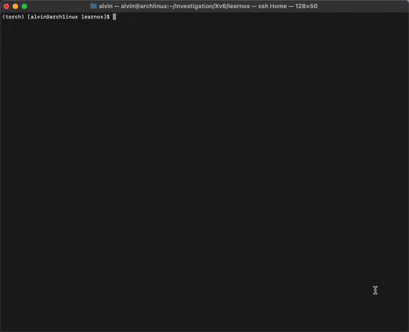

# 进栈不排队-OS原理赛道：内核实现方向

```
  █████████                                                                         ███████     █████████
 ███░░░░░███                                                                      ███░░░░░███  ███░░░░░███
░███    ░░░  █████ ████ ████████  ████████   ██████  █████████████    ██████     ███     ░░███░███    ░░░
░░█████████ ░░███ ░███ ░░███░░███░░███░░███ ███░░███░░███░░███░░███  ███░░███   ░███      ░███░░█████████
 ░░░░░░░░███ ░███ ░███  ░███ ░███ ░███ ░░░ ░███████  ░███ ░███ ░███ ░███████    ░███      ░███ ░░░░░░░░███
 ███    ░███ ░███ ░███  ░███ ░███ ░███     ░███░░░   ░███ ░███ ░███ ░███░░░     ░░███     ███  ███    ░███
░░█████████  ░░████████ ░███████  █████    ░░██████  █████░███ █████░░██████     ░░░███████░  ░░█████████
 ░░░░░░░░░    ░░░░░░░░  ░███░░░  ░░░░░      ░░░░░░  ░░░░░ ░░░ ░░░░░  ░░░░░░        ░░░░░░░     ░░░░░░░░░
                        ░███
                        █████
                       ░░░░░
```



## 目录
- [进栈不排队-OS原理赛道：内核实现方向](#进栈不排队-os原理赛道内核实现方向)
  - [目录](#目录)
  - [基本信息](#基本信息)
  - [项目简介](#项目简介)
  - [项目结构](#项目结构)
  - [如何运行](#如何运行)
    - [运行环境](#运行环境)
    - [qemu虚拟机运行](#qemu虚拟机运行)
    - [执行GDB调试](#执行gdb调试)
  - [工作计划](#工作计划)
  - [参考文件](#参考文件)
  - [贡献者](#贡献者)

## 基本信息

- **比赛类型**：OS原理赛道：内核实现方向
- **学校名称**：杭州电子科技大学
- **队伍编号**：T202410336994460
- **队伍名称**：进栈不排队-SupremeOS
- **队伍成员**：
  - 温学周
  - 林灿
- **指导老师**：杨浩

## 项目简介

`SupremeOS` 基于 `MIT` 开源的 `Xv6` 操作系统框架，构建 `RISC-V` 架构的类 `Unix` 操作系统。截至初赛，总共新增了**19**个系统调用，总计**40**个系统调用。

提升了三大模块相关内容：

- **内存管理模块优化**： 我们对内存管理模块进行了深度改进，实现了更高效、更智能的内存分配与回收策略，有效提升了系统资源的利用率和整体性能。

- **进程通信模块升级**： 在进程通信模块方面，我们引入了创新的通信机制，增强了进程间的交互能力，为多任务处理和并发执行提供了更稳固的支撑。

- **进程管理模块强化**： 我们对进程管理模块进行了全面强化，优化了进程调度算法，提高了进程的创建、切换和终止效率，进一步确保了系统的稳定性和响应速度。

<!-- 总结构图 -->
<div align = center>

<p style="font-size: 12px">项目总体结构图</p>
</div>

## 项目结构

| 文件名 | 描述 |
| :---: | :---: |
| [mkfs](./mkfs/) | 构建和运行Xv6内核 |
| [README](./README) | 项目简介和说明 |
| [doc](./doc) | 项目的比赛报告 |
| [kernel](./kernel/) | 内核源代码目录 |
| [user](./user/) | 用户源代码目录 |
| [dockerfile](./dockerfile) | docker编译相关文件 |
| [docker-compose.yml](./docker-compose.yml) | docker编译相关文件 |
| [start_docker.sh](./start_docker.sh) | 快速启动docker环境 |
| [LICENSE](./LICENSE) | 项目的许可证文件 |
| [Makefile](./Makefile) | 项目的Makefile文件 |

## 如何运行

### 运行环境

- Ubuntu 22.04 & Arch
- gcc RISC-V 交叉编译器，QEMU模拟器

本项目配置了`docker`包，可以快速一键启动：

```bash
# 拉取 docker 包
docker pull linermao/xv6-riscv-env:latest
# 快速启动，进入 docker 环境
./start_docker.sh
```

也可以本地编译：

```bash
# 修改 docker-compose.yml
..
# dockerfile: linermao/xv6-riscv-env
dockerfile: dockerfile
..
```

### qemu虚拟机运行

```bash
# learnos/
make qemu
```

### 执行GDB调试

```bash
make qemu-gdb
```

## 工作计划

- [ ] 实现基于优先级的多级反馈队列调度算法，允许抢占式调度，提高系统的响应速度和吞吐量

- [ ] 引入 `CPU` 亲和性的进程调度，并对内存管理模块的 `buddy` 和 `slab` 进行优化，为每个 `CPU` 引进缓存，提高 `cache` 的命中率

- [ ] 引入线程概念，实现用户级线程和内核级线程

- [ ] 为信号量集引入内核级别的死锁的检测与预防机制

- [ ] 实现内存的页缓存

- [ ] 实现信号机制

- [ ] 实现文件映射和匿名映射

- [ ] 实现虚拟文件系统

- [ ] 实现基于`FAT32`的文件系统

- [ ] 提供除串口I/O设备以外的更多的设备支持

- [ ] 完善网络模块，提供本地socket接口和与硬件接口交互的网络驱动程序

- [ ] 完善用户态应用程序的生态，引入代码编辑器，编译器等工具链

## 参考文件

- [MIT-Xv6-Riscv源码](https://github.com/mit-pdos/xv6-riscv)
- [Xv6中文文档](https://th0ar.gitbooks.io/xv6-chinese/content/)
- [博客园：xv6-riscv内核调试教程](https://2017zhangyuxuan.github.io/2022/03/19/2022-03/2022-03-19%20%E7%8E%AF%E5%A2%83%E6%90%AD%E5%BB%BA%E7%B3%BB%E5%88%97-xv6%E5%86%85%E6%A0%B8%E8%B0%83%E8%AF%95%E6%95%99%E7%A8%8B/)
- [6.S081-All-In-One-Gitbook](https://xv6.dgs.zone/)

## 贡献者

- 温学周：[wxz](https://github.com/Firefly-Star)
- 林灿：[Linermao](https://github.com/Linermao)