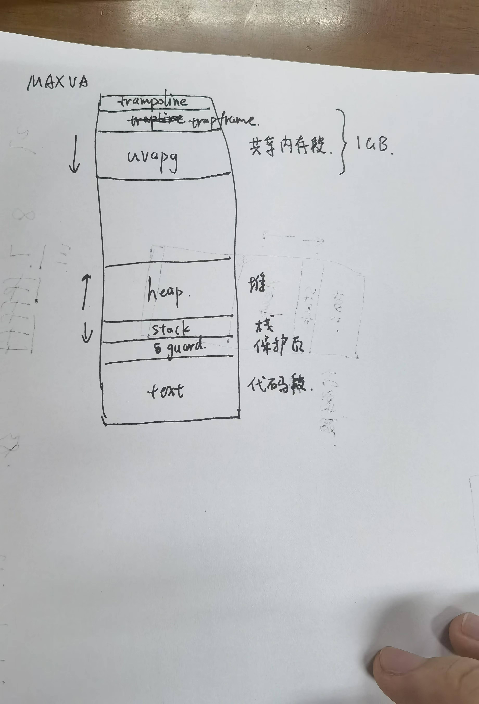
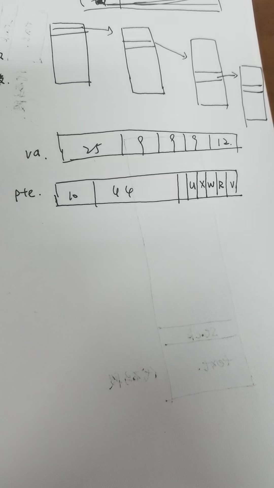
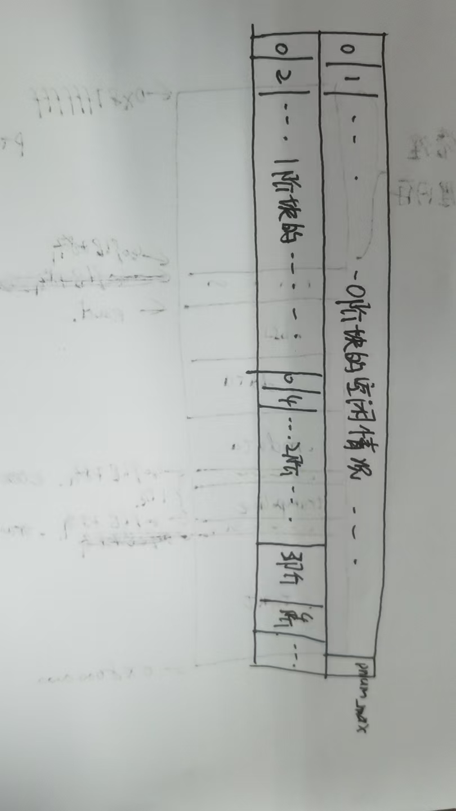
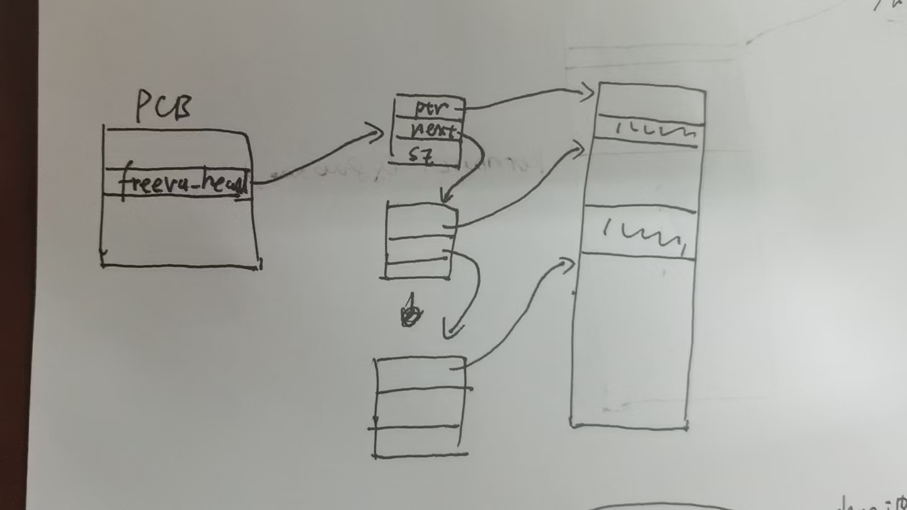
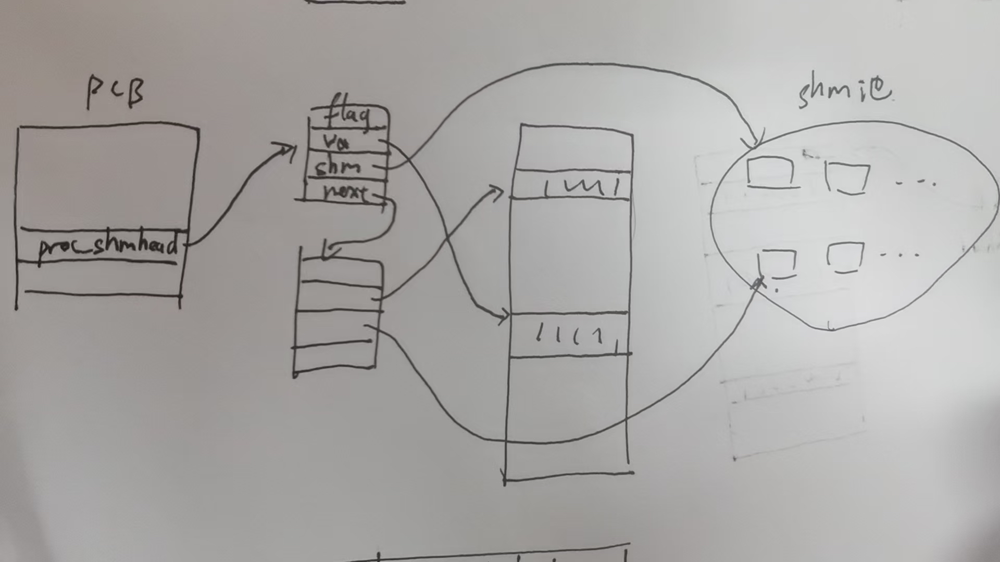

# 我们的OS还没有取名
本项目是一个在xv6-riscv的基础上进行重构优化和改进的，运行于Risc-V架构的类Unix操作系统。
截至初赛，我们的OS在xv6-riscv的基础上新增了19个系统调用，总计40个系统调用。
我们的OS对xv6-riscv作出的主要改进和提升体现在内存管理模块，进程通信模块，进程管理模块。
以下是我们各模块的完成情况。

这里一个表格
内存管理：(1)修改xv6的用户虚拟内存空间，新增虚拟内存段(2)实现伙伴系统和slab内存分配，实现O(1)的内核内存分配算法(3)实现懒分配和写时复制
进程通信：(1)实现信号量集机制(2)实现共享内存机制(3)实现消息队列
进程管理: (1)实现优先级队列调度(2)实现vfork

目录
一、概述
1.1 xxOS介绍
1.2 操作系统整体架构
1.3 目录和文件描述
二、xxOS的设计与实现
2.1 内存管理
2.1.1 概述
2.1.2 地址空间
2.1.3 内存映射
2.1.4 伙伴系统
2.1.5 slab分配器
2.1.6 懒分配
2.1.7 写时复制
2.2 进程通信
2.2.1 概述
2.2.2 IPC宏
2.2.3 共享内存
2.2.4 信号量
2.2.5 消息队列
2.3 进程管理
2.3.1 概述
2.3.2 优先级队列调度
2.3.3 vfork
2.4 辅助性的系统调用
2.4.1 时间相关
2.4.2 系统调用跟踪
三、总结与展望
3.1 工作总结
3.2 经验总结
3.3 未来计划

一、概述(TODO)
1.1 介绍
我们的操作系统基于 RISC-V 架构，运行于 RV64 指令集之上，并采用 SV39 虚拟内存管理机制，实际物理内存限制为 128MB。这种配置允许操作系统有效利用虚拟地址空间进行内存管理，同时满足特定的硬件资源约束与应用需求。
1.2 整体架构

1.3 目录和文件描述

二、xxOS的设计与实现
2.1 内存管理
2.1.1 概述
在 xxOS 操作系统中，内核态与用户态进程各自拥有独立的地址空间，这种内存隔离有效保护了内核数据结构，防止用户态程序的意外访问与篡改，从而降低了安全风险和系统不稳定性。

该机制依赖于内存管理单元（MMU），负责虚拟地址到物理地址的转换及不同地址空间的隔离。当用户态进程尝试访问受保护的内核资源时，MMU 会拦截此行为并生成页面错误（Page Fault），触发内核异常处理程序进行相应处理。

为了增强安全性，xxOS 使用 copyout 和 copyin 接口在内核态与用户态之间进行数据传输。这些接口要求显式指定数据源和目标内存区域，确保数据传输的完整性和一致性，并使错误处理更加明确和可追踪。

通过这种设计，xxOS 利用 MMU 的内存保护机制，确保仅授权的访问得以执行，从而进一步提升了系统的可靠性和安全性。

2.1.2 地址空间
在硬件层面的约定中，我们为 QEMU 虚拟机配置了 128MB 的物理内存。根据 RISC-V 架构规范，从 0x00000000 到 0x7FFFFFFF，被用于其他设备，而从 0x80000000(KERNBASE) 起的地址空间则预留用于引导程序和内核。因此，物理内存管理重点关注地址范围 KERNBASE 至 0x87FFFFFF(PHYSTOP) 之间的空间。

在采用 SV39 虚拟内存管理机制的背景下，理论上虚拟地址可扩展至 39 位。然而，考虑到 RISC-V 设计中对有符号扩展的支持，最高位用于符号表示可能会增加虚拟地址处理的复杂性。因此，我们将有效虚拟地址限制为 38 位，主要针对 0x0 至 0x3FFFFFFFFF(MAX_VA) 的范围进行内存管理。

结合这一约定，xxOS 对内核空间和用户空间作了以下划分：

内核空间布局

其中，在 KERNBASE 至 PHYSTOP 之间的空间的布局如下图所示。该布局由 kernel.ld 文件定义。

用户空间布局

用户空间的布局如下图所示，其中包括各个段的分配与映射。

对这两个图做解释

2.1.3 内存映射
xxOS 采用 RV64 指令集与 SV39 地址管理机制。

每个虚拟地址为 64 位，其中高 25 位无效，后 39 位被分为 9、9、9、12 四个部分，分别对应三级页表、二级页表、一级页表和页内偏移量。单个物理页大小为 4096(PGSIZE) 字节。

SV39 地址管理机制采用三级页表结构，页表项的大小为 8 字节，其中高 10 位无效，第 53 位到第 10 位承载下一级页表或数据页的物理页号，末尾 10 位用于标志位，记录有效位、读、写、执行及用户态访问权限。

内核空间的映射中，从 KERNBASE 至 PHYSTOP 之间的空间被直接映射，KERNBASE下面有几块地址用于设备管理，也是直接映射至虚拟内存。除此以外，该区域的顶部被映射至代码段中的 trampoline段(前文的布局中有提到，是用于用户态和内核态之间切换时的上下文保存的代码段)，用于快速切换至内核态。紧接着，该区域下方分配了 64 页的物理内存、128页的虚拟内存用于内核栈，并通过使用 guard page 在每两页栈之间进行保护，以及时捕获潜在的栈溢出事件。

用户空间的映射采用随机的物理页映射方式。在进程创建（如 fork 或 exec）时，操作系统会调用 kalloc 以获取物理页，并调用 uvmmap 函数进行代码段、数据段、栈段、trapframe 页及 trampoline 页的映射。此时，堆段的映射将在懒分配部分中进一步说明，共享内存段的映射将在后续的进程间通信讨论中展开。

2.1.4 伙伴系统
2.1.4.1 概述
伙伴系统和slab分配器是内核中用于分配物理内存的机制。其中，伙伴系统用于以页为单位分配物理页，slab分配器以更小的单位(例如8B，16B等等)进行分配小块的物理内存。

我们的伙伴系统仿照linux的思路，支持从0阶到MAX_ORDER = 11阶大小的内存块的分配，其中k阶大小的内存块的大小为2^k页，即2^(k + 12)B大小的连续内存。

我们将空闲页(从end, 上文提到的内核代码和数据段结束后的首地址， 到PHYSTOP之间的物理内存)以PGSIZE为单位，按照物理地址从低到高从0开始依次编号。

伙伴系统对外开放的接口如下: 
void            kinit(void); // 初始化伙伴系统
void*           kbuddy_alloc(uint32 order); // 获取一块order阶大小的内存块
void            kbuddy_free(void* ptr, uint32 order); // 释放一块order阶大小的内存块
void*           kalloc(void); // 即为 kbuddy_alloc(0) 获取一页内存
void            kfree(void* ptr); // 即为 kbuddy_free(ptr, 0)释放一页内存

2.1.4.2 伙伴系统相关的数据结构

struct {
    char bitmap_page[2 * PGSIZE];
    struct run freelist_page[MAX_ORDER + 1]; // 可以理解成一个地址数组，freelist_page[i]中存放的是i阶内存块的链表首地址
    char* start;
    struct spinlock lock;
    struct ref_stru freelist; // 内存计数
} buddy;

bitmap_page是伙伴系统的位图，里面存储了各个以i号页为起始页的各阶内存块的空闲情况，布局如下:

其中某一位为0表示以i页号为起始页的k阶内存块为空闲的，为1则表示被占用着。我们用buddy_bitmap_offset[]数组来记录各阶内存块的位视图在bitmap_page中的偏移量，其中buddy_bitmap_offset[k]中记录了各个k阶空闲块的位视图的偏移量。

这种多阶的位视图对比一阶的位视图，仅仅多用了一页的位视图，就能让判断以任意页号为起始页的任意阶内存块和它的伙伴块是否为空闲的复杂度，从原本o(2^k)变为了o(1)的时间。这样的开销是值得的。

freelist_page是一个地址数组，freelist_page[i]中存放的是i阶内存块的链表首地址。其中run的结构如下：

struct run {
    struct run* prev;
    struct run* next;
};

这是一个双向链表的结点，用于原地地存储某个空闲块的上一块内存和下一块内存的地址。这个链表的布局如下：

我们将空闲块的链表信息直接存储在空闲块的内部，这种隐式链表的优化减少了额外的内存开销和额外的指针存储，降低了内存访问次数，系统可以更快地找到和管理内存块，提高了内存分配的效率。同时，内存块地址即链表结点地址的设计也让我们能够以o(1)的时间内对链表中部的结点进行"随机访问"，兼具了线性结构和链式结构的优点。这种隐式链表在slab中也会有所用到。

start为0号内存的首地址，用于页号和物理地址的转换。

lock是一个内核自旋锁，用于保护buddy内部成员的并发访问。

freelist(TODO)

2.1.4.3 伙伴系统的初始化

在xxOS的初始化中，0号cpu会调用buddy_init()来进行伙伴系统的初始化。

void buddy_init(){
    initlock(&buddy.lock, "buddy"); // 初始化自旋锁

    pa_start = (char*)PGROUNDUP((uint64)end); // 将kernel.ld提供的end地址按照PGSIZE对齐
    buddy.start = pa_start; // 设置buddy管理的内存段的起始地址为start
    pnum_max = (PHYSTOP - (uint64)buddy.start) / PGSIZE; // 最大页号
    printf("pnum_max: %lu\n", pnum_max);

    buddy_init_bitmap(); // 将位视图置为全1，即全部被占用。
    buddy_init_freelist(); // 根据pnum_max，将从pa_start到PYHSTOP之间的各块物理页按照最大适配的算法加入到buddy.freelist_page中，并且将位视图的对应位置0，即置为空闲
}

2.1.4.4 伙伴系统的分配

函数 void* buddy_alloc(uint32 order) 的任务是分配一块
2^order页大小的连续物理内存。其算法流程如下：

从 buddy.freelist_page[order] 开始查找第一个空闲块，采用链表形式的存储结构，在O(1)时间复杂度内直接找到所需阶数的空闲块。
核心逻辑为当找到的空闲块超过目标阶数时，系统将其分步拆分为所需大小，同时将上半部分返回至对应阶数的空闲链表。
以下是分配的具体实现：
void* buddy_alloc(uint32 order)
{
    if (order > MAX_ORDER)
        panic("buddy_alloc: order out of bound.");
    int free_order = order;
    // 找到第一个空闲块
    while(free_order <= MAX_ORDER && (buddy_getfirst(free_order) == 0))
    {
        ++free_order;
    }

    if (free_order > MAX_ORDER)
        return NULL;
        // panic("buddy_alloc: bad alloc.");
    
    // 将free_order给逐步拆分成order阶的内存块
    void* mem_block = buddy_erasefirst(free_order);
    if (free_order > order)
    {
        while(free_order > order)
        {
            --free_order;
            void* upper_block = (void*)((uint64)mem_block + (1 << free_order) * PGSIZE);
            buddy_insertfirst(upper_block, free_order); // 把地址相对较高的给存入链表中
        }
    }
    return mem_block;
}

2.1.4.5 伙伴系统的释放

函数 void buddy_free(void* block_start, uint32 order) 的任务是释放一块 2^order 页大小的物理内存。其算法流程如下：

首先，函数检查传入的内存块起始地址 block_start 是否符合对齐要求。
接着，计算该内存块的伙伴块地址，并检查它是否空闲。
如果伙伴块为空闲状态，则从相应的空闲链表中将其移除，并向高阶合并；否则，将当前块加入到空闲链表中。
这个过程将一直继续，直到无法合并为止，或者达到了最大阶数。

由于我们的位视图可以在o(1)的时间内检查一个任意阶的内存块的伙伴是否为空闲的，所以这整个过程的复杂度也为o(1)。

以下是释放的具体实现：

void buddy_free(void* block_start, uint32 order)
{
    // 将物理地址转换为页号
    uint64 pnum = pa_to_pnum(block_start);
    
    // 检查页号是否符合对齐要求
    if (pnum & ((1 << order) - 1))
    {
        // 数据不符合要求，输出错误并终止程序
        printf("%lu\n", pnum);
        panic("buddy_free: unaligned block.");
    }

    // 初始化自由阶为要释放的阶
    uint32 freeorder = order;
    
    // 尝试合并直到达到最大阶数
    while(freeorder < MAX_ORDER)
    {
        // 计算伙伴的页号（按位异或）
        uint64 buddy_pnum = pnum ^ (1 << freeorder);
        
        // 检查伙伴块是否在有效范围内且为空闲
        if (buddy_pnum < pnum_max && !buddy_getbitmap(buddy_pnum, freeorder))
        {
            // 伙伴块空闲，进行合并
            // 从 corresponding 链表中移除伙伴块
            struct run* buddy_ptr = pnum_to_pa(buddy_pnum); 
            buddy_erase(buddy_ptr, freeorder); // 移除伙伴

            // 更新当前块的页号（按位清除对应位）
            pnum &= ~(1 << freeorder);
            // 提高自由阶级
            ++freeorder;
        }
        else
        {
            // 伙伴块不空闲，将当前块放入 freeorder 的链表中
            buddy_insertfirst(pnum_to_pa(pnum), freeorder);
            break; // 不再合并，直接退出
        }
    }

    // 如果合并到达最大阶数，则将当前块加入到相应链表
    if (freeorder == MAX_ORDER)
    {
        buddy_insertfirst(pnum_to_pa(pnum), freeorder);
    }

    return; // 释放过程结束
}

2.1.5 slab分配器

2.1.5.1 概述
slab 分配器是内核中用于高效分配小块物理内存的机制。与伙伴系统以页为单位分配物理内存不同，slab 分配器以更小的内存块（例如 8B、16B 等）进行分配，这样可以减少内存碎片并提高内存利用率。

slab 分配器使用一个名为 kmem_cache 的结构体来管理不同大小的内存块池，支持小对象（小于等于 16B）和大对象（大于 16B）的分配。它通过将空闲块组织为链表的方式，提高了内存分配和释放的效率。

slab的总体思路是首先调用伙伴系统来获取一些物理页，将这些物理页给拆分成多个相同大小的对象块，每次分配都以对象块为单位进行内存的分配，减少了内存碎片的同时，将内存分配的复杂度从链式管理的o(n)减小到了o(1)。

在实现的过程中，我们对小对象和大对象的slab池的结构作了不同的优化，更大限度地利用了空闲内存。

slab系统不仅提供了不同大小的全局内存块池，对于一些经常分配的特定大小的对象，slab还开放了接口用于创建管理特定大小的slab池，进一步地减少了内存碎片。

slab池对外开放的接口列表为
void            kmem_cache_create(struct kmem_cache* cache, char* name, uint16 sz, uint16 align, uint16 init_pgnum); // 构造一个名字为name, 期望分配内存块大小为sz, 地址按照align对齐, 初始拥有init_pgnum页大小的slab池
void            slab_init(); // 初始化对象大小分别为8B, 16B, 32B, 64B, 128B, 256B, 512B, 1024B的内核全局slab池
void            kmem_cache_destroy(struct kmem_cache*, int flag); //
析构这个slab池
void*           kmem_cache_alloc(struct kmem_cache*); // 从该内存池中分配一个对象
void            kmem_cache_free(struct kmem_cache*, void*); // 释放一个该内存池的对象

2.1.5.2 slab相关数据结构

slab结构体的定义如下:

struct kmem_cache{ 
    char* name;             // debug用的名字
    uint16 size;            // 期望分配的内存块的大小
    uint16 align;           // 期望分配的内存块的对齐标准
    uint16 unitsz;          // slab内存池内部实际存储的对象的大小
    uint64 alloc_count;     // 已分配的对象个数，它会在每次分配中自增，每次释放中自减
    struct spinlock lock;   // 保护临界资源的自旋锁
    union pagelink head;    // 内存池所管理的页的链表首指针
};

unitsz是根据size和align计算出来的，比如size = 15， align = 4，即如果想要每次分配15B的内存块，并且地址按照四字节对齐，那么我们的slab内部会实际上给每个对象分配16B的大小。

head是该内存池所管理的页的链表首指针。union pagelink的定义为

union pagelink{
    struct snode* shead;
    struct lnode* lhead;
};

struct snode{
    struct snode* next;
};

struct lnode{
    char* curpage;
    struct lnode* next;
};

其中的snode和lnode分别是小对象和大对象的页链表的结点，snode采用隐式链接，lnode采用显式链接。它们的链接结构如下：

对于小对象池，我们采用隐式链接，将下一页的地址存储在这一页的第一个对象所在的位置，避免了显式链接的结点的内存开销;对于大对象池，如果使用每一页的第一个对象来存储下一页的地址，会导致远大于8B的内存空间中只利用了8B，过于浪费，因此我们采用了显式链接，用外部的链接结点来指向下一页的地址。

无论对于大对象池还是小对象池，我们都使用隐式链接，在空闲块的位置中存储下一个可用对象的位置，采用的结构体为：

struct freeblock{
    struct freeblock* next;
};

其内部结构为：

隐式链接大幅减少了slab内部空闲对象链接所需要的内存空间。

2.1.5.3 slab池的构造函数

kmem_cache_create会根据sz和align的大小，调用init_large_object_pool或者init_small_object_pool，构建上述的针对不同大小对象slab池的结构。

void kmem_cache_create(struct kmem_cache* cache, char* name, uint16 sz, uint16 align, uint16 init_pgnum)
{
    if(align == 0 || align & (align - 1))
        panic("kmem_cache_create: invalid alignment."); // 检查align是否为2的幂次

    initlock(&(cache->lock), name); // 初始化cache内部的自旋锁

    cache->size = sz; 
    cache->align = align;
    cache->unitsz = ALIGN_UP(sz, align); // 将sz关于align向上对齐
    if (sz > 16)
    {
        cache->head.lhead = init_large_object_pool(cache->unitsz, init_pgnum); // 将这个slab初始化为一个大对象池
    }
    else
    {
        cache->head.shead = init_small_object_pool(cache->unitsz, init_pgnum); // 将这个slab初始化为一个小对象池
    }

    printf("%s initialized.\n", name);
}

其中的init_large_object_pool和init_small_object_pool就是按照上述的结构，分配相应大小的页数，用相应的pagelink将它们链接起来，将页面的内部分割成相同大小的对象，用隐式链接将其和下一个空闲对象块链接起来。(这里不知道要不要贴上代码，因为代码不短)

2.1.5.4 slab池的初始化

main函数中，会调用slab_init，初始化一系列管理不同大小对象的全局slab池。

void slab_init()
{
    kmem_cache_create(&g_slab_8, "g_slab_8", 8, 8, 2);
    kmem_cache_create(&g_slab_16, "g_slab_16", 16, 16, 2);
    kmem_cache_create(&g_slab_32, "g_slab_32", 32, 32, 2);
    kmem_cache_create(&g_slab_64, "g_slab_64", 64, 64, 2);
    kmem_cache_create(&g_slab_128, "g_slab_128", 128, 128, 2);
    kmem_cache_create(&g_slab_256, "g_slab_256", 256, 256, 1);
    kmem_cache_create(&g_slab_512, "g_slab_512", 512, 512, 1);
    kmem_cache_create(&g_slab_1024, "g_slab_1024", 1024, 1024, 1);
    kmem_cache_create(&g_slab_kmem_cache, "g_slab_kmem_cache", sizeof(struct kmem_cache), 8, 1);
}

2.1.5.5 slab池的析构

kmem_cache_destroy会析构一整个缓存池，flag指示了此次析构是否是强制性的。如果flag = 0(非强制性析构)，且这个缓存池的alloc_count非零(还有对象未被释放)，则会报错。在析构的过程中，所需要做的事情就是根据这个slab池所管理的物理页链表将其析构，并释放显式链接中的结点。

void kmem_cache_destroy(struct kmem_cache* cache, int flag)
{
    acquire(&cache->lock);
    if (!flag && cache->alloc_count) // 非强制析构且slab池中有对象未被释放
    {
        release(&cache->lock);
        panic("kmem_cache_destroy.");
    }
    if (cache->size > 16)
    {
        destroy_large_object_pool(cache); // 根据显式链接的链表释放所管理的物理页
    }
    else
    {
        destroy_small_object_pool(cache); // 根据隐式链接的链表释放所管理的物理页
    }
    release(&cache->lock);
}

2.1.5.6 slab对象的分配

kmem_cache_alloc会从对应的slab池中取出首个空闲块。由于我们的slab池的对象之间的链接使用的是链式结构，因此这一分配过程的复杂度为o(1)。如果slab池中没有对应的空闲对象，则会向伙伴系统新申请一页缓存，然后重新进行分配。

void *kmem_cache_alloc(struct kmem_cache * cache)
{
    acquire(&cache->lock);
    if(cache->size > 16)
    {
        return alloc_large_object_pool(cache); // 对大对象池的对象分配
    }
    else
    {
        return alloc_small_object_pool(cache); // 对小对象池的对象分配
    }
}

2.1.5.7 slab对象的释放

kmem_cache_free比kmem_cache_alloc会首先检查这个对象是否是该slab池所管理的对象，如果是，则会将待释放对象给链接成为新的首个可用对象。最近被释放的对象也会成为下一次分配中最先被分配的，在一定程度上也提高了cache的命中率。(本来想过给slab染色的，后来想了想进程的调度没有做到cpu亲和，直接给slab染色可能效果也不好。这一段要写进去吗)

void kmem_cache_free(struct kmem_cache* cache, void* pa)
{
    acquire(&cache->lock);
    if(cache->size > 16)
    {
        free_large_object_pool(cache, pa);
    }
    else
    {
        free_small_object_pool(cache, pa);
    }
    release(&cache->lock);
}

2.1.5.8 伙伴系统和slab的结合：kmalloc
有了伙伴系统和slab，现在我们的操作系统内核可以分配几乎任意大小的连续内存了。因此我们使用kmalloc和kmfree来对全局的内存分配和释放进行封装，提供一个方便的接口。kmalloc会根据请求的内存块的大小，自动地选择最合适的分配器进行分配。

void* kmalloc(uint64 sz)
{
    if (sz > 2048) // 超过slab池所能分配的最大大小，采用伙伴系统按页分配
    {
        uint pgnum = ((sz + PGSIZE - 1) / PGSIZE);
        int order = 0;
        while((1U << order) < pgnum)
        { // 计算获得最接近的阶数
            ++order;
        }
        return kbuddy_alloc(order); // 用伙伴系统进行分配
    }
    else
    { // 根据请求的内存块的大小，从最合适的slab池中分配内存
        if (sz > 1024)
            return kmem_cache_alloc(&g_slab_2048);
        else if (sz > 512)
            return kmem_cache_alloc(&g_slab_1024);
        else if(sz > 256)
            return kmem_cache_alloc(&g_slab_512);
        else if(sz > 128)
            return kmem_cache_alloc(&g_slab_256);
        else if(sz > 64)
            return kmem_cache_alloc(&g_slab_128);
        else if(sz > 32)
            return kmem_cache_alloc(&g_slab_64);
        else if(sz > 16)
            return kmem_cache_alloc(&g_slab_32);
        else if(sz > 8)
            return kmem_cache_alloc(&g_slab_16);
        else
            return kmem_cache_alloc(&g_slab_8);
    }
}

kmfree的思路与kmalloc一致。

2.1.6 懒分配

TODO

2.1.7 写时复制

TODO

2.2 进程通信
2.2.1 概述
在现代操作系统中，进程间通信（Inter-Process Communication, IPC）是确保进程协同工作的关键机制。xxOS在设计过程中借鉴了 System V IPC 接口的成熟模型，旨在实现一个高效且易用的进程通信模块，支持共享内存、信号量和消息队列三种主要通信机制。我们通过对 System V 的接口进行分析与改进，设计出严格RAII的，适合本操作系统架构的 IPC 解决方案，以实现更高的安全性和灵活性。
2.2.2 IPC相关宏
IPC.h中定义了一些IPC通用的宏，用于分析指令和处理权限。权限控制中，我们将32位的flag的后12位划分给权限位，其中第8-11位为该IPC所有者的权限位，第4-7位为该IPC同组成员的权限位，第0-3位为其他用户的权限位。

// 命令
#define IPC_SET         0
#define IPC_RMID        1
#define IPC_STAT        2

// 属性
#define IPC_EXCL        1U << 14 // 已经有该键值的IPC时，会报错
#define IPC_CREATE      1U << 15 // 在有需要的前提下进行IPC的创建
#define IPC_NOWAIT      1U << 16 // 非阻塞式命令

// 权限控制
#define IPC_OWNER_MASK  15U << 8 // flag的第8位到第11位为该IPC所有者的权限位
#define IPC_GROUP_MASK  15U << 4 // flag的第4位到第7位为该IPC同组成员的权限位
#define IPC_OTHER_MASK  15U      // flag的第0位到第3位为其他用户的权限位
#define IPC_R           1 << 1 // 读权限
#define IPC_W           1 << 2 // 写权限
#define IPC_X           1 << 3 // 执行权限
#define IPC_C           1 << 4 // 修改权限的权限

// 可见性控制
#define IPC_PRIVATE     0 // 表示匿名的ipc，用于进程内的标识

enum ipcstate // IPC的状态。
{
    IPC_UNUSED, // 空闲的IPC
    IPC_ZOMBIE, // 有程序正在引用但是被置为可以被析构的控制块，一旦引用计数归零就会被析构
    IPC_USED    // 不会因为引用计数归零而被析构的IPC
};

为了实现键值到IPCID的映射，我们在 ipc_hash.h 中定义了一套通用的 Hash 宏作为泛型，用于支持不同 IPC 池的操作。解决IPC桶中的哈希冲突，我们采用了线性探测法。这种设计确保了在不提高代码复杂度的前提下在碰撞发生时能够有效地定位到可用的存储位置，从而提高了哈希表的整体性能和存取效率。

// 从uint64到poolsize大小的IPC桶的哈希。
#define HASH_FUNC(poolsize) \
static ipc_id hash(key_t key) \
{ \
    return key % (poolsize); \
}

// 如果找到了key,那么返回key所在的id,如果没找到key,返回第一个空闲的id,如果满了,返回-1
// 0为保留key，不能有shm的键值为0
#define AT_FUNC(name, poolsize) \
ipc_id name##_at(key_t key) \
{ \
    ipc_id id = hash(key); \
    ipc_id origin_id = id; \
    ipc_id first_free = -1; \
    int find_free = 0; \
    for (;;) \
    { \
        acquire(&name##id_pool[id].lk); \
        if (name##id_pool[id].key == key) \
        { \
            release(&name##id_pool[id].lk); \
            break; \
        } \
        if (!find_free && name##id_pool[id].state == IPC_UNUSED) \
        { \
            find_free = 1; \
            first_free = id; \
        } \
        release(&name##id_pool[id].lk); \
        id = (id + 1) % (poolsize); \
        if (id == origin_id) \
            break; \
    } \
    acquire(&name##id_pool[id].lk); \
    if (name##id_pool[id].key != key) \
    { \
        release(&name##id_pool[id].lk); \
        return first_free; \
    } \
    else \
    { \
        release(&name##id_pool[id].lk); \
        return id; \
    } \
}

2.2.3 共享内存
2.2.3.1 概述
共享内存(shm)是一种高效的进程间通信（IPC）机制，允许多个进程访问同一块物理内存区域。这种机制尤其适用于需要快速数据交换和低通信延迟的应用场景，例如多媒体处理、实时数据分析和高性能计算等。相比其他IPC方式，共享内存的性能优势在于用户态进程可以直接通过内存解引用操作访问共享数据，而无需频繁切换到内核态，大幅减少了系统开销。然而，这种高效性也伴随着潜在的安全性和一致性风险，需要在设计中加以权衡和管理。

在我们的操作系统设计中，共享内存的管理策略如下：

内存分配与记录：操作系统在内核中分配特定大小的空闲物理内存区域，并使用 shmblock 数据结构记录每段共享内存的元信息。

虚拟地址布局：在内存管理中有提到，共享内存段位于用户态地址空间的trapoline和trapframe之下的 1 GB 虚拟地址空间中。这一布局设计确保了共享内存段的位置固定且易于管理。

虚拟地址映射：每当用户进程申请一段共享内存，操作系统会从共享内存段中划分出一块可用的虚拟地址范围，并通过MMU建立该虚拟地址与物理内存的映射关系。一旦映射完成，用户进程可以直接访问共享内存，无需进一步的内核态交互，从而降低 IPC 开销。

此外，我们采用资源获取即初始化（RAII）的思想来管理共享内存的生命周期。每个进程会记录其映射的共享内存段。当某块共享内存被标记为 IPC_ZOMBIE 状态且引用计数降为零时，系统才会回收并释放对应的物理内存。这种设计确保了资源的自动管理和安全释放，避免了资源泄漏的风险。

共享内存相关的系统调用：
int     shmget(key_t key, uint64 size, int shmflg); // 根据key来获取或者创建一块共享内存，大小为size，shmflg指示了该共享内存的权限。例如shmflg = IPC_CREATE | IPC_EXCL | 0x666，指示了此次shmget将创建一个对所有者，同组成员，其他成员均可读可写的共享内存，且如果已经有了相同键值的共享内存，将会返回错误。
void*   shmat(ipc_id shmid, const void* shmaddr, int shmflg); //
 将shmid对应的共享内存块给映射至用户空间的虚拟地址shmaddr。当shmaddr为NULL(0)时，代表由操作系统自己来分配可用的虚拟地址。shmflg将与shm本身的权限进行按位与，生成该进程对于该共享内存的权限。
void    shmdt(void* shmaddr); // 将shmaddr所映射的那块共享内存从本进程中剥离，解除映射。
int     shmctl(int shmid, int cmd, struct shmid_ds *buf); // 对shmid所对应的共享内存进行操作，操作码由cmd指定。可用的cmd有IPC_STAT(获取该IPC的状态)， IPC_SET(修改IPC的权限，需要有修改权限的权限)，IPC_RMID(将该共享内存标志为IPC_ZOMBIE，即可删除状态，一旦它的引用计数归零，则共享内存将会被释放)。

2.2.3.2 共享内存相关的数据结构

共享内存控制块的结构：

struct shmblock {
    struct spinlock lk;             // 保护临界资源的自旋锁
    ipc_id          id;             // IPC 资源 ID
    uint            sz;             // 共享内存段大小，单位为字节
    int             ref_count;      // 当前附加的进程数
    uint            flag;           // 权限
    key_t           key;            // 键值
    void*           ptr;            // 共享内存实际的物理地址
    enum ipcstate   state;          // 该共享内存的状态
};

struct shmblock shmid_pool[SHMMAX];

每一个shmblock都唯一对应着一个共享内存。在内核中，用shmid_pool来管理全部的共享内存，每次申请共享内存，都会从shmid_pool中进行申请。

用户用以修改和获取shmid信息的结构体：

struct shmid_ds {
    uint            sz;             // 共享内存段大小
    int             ref_count;      // 当前附加的进程数
    uint            flag;           // 权限
    enum ipcstate   state;          // 该共享内存的状态
};

在shmctl中，如果操作码是IPC_STAT，则shmblock的相应信息将被复制到shmid_ds中，如果是IPC_SET，则会忽视shmid_ds中除了flag之外的其他字段。这样的设计让用户态与内核态的共享内存相隔离，不能直接地访问内核的shm控制块，进一步加强了安全性。

前文提到，共享内存的映射将被映射至用户地址空间的共享内存段，进程将使用freeva链表来维护可用的虚拟地址块，并采用最先适应的算法来进行虚拟地址分配。同时，每次共享内存的映射完成后，进程会使用proc_shmblock来维护该进程所有的共享内存引用，在进程被释放或者调用shmdt进行共享内存块的剥离时，这些引用也会被释放，用于管理共享内存的生命周期。

对这两个图进行解释

struct freeva
{
    uint64 ptr;
    struct freeva* next;
    uint64 npg;
};

struct proc_shmblock
{
    uint flag;
    void* va;
    struct shmblock* shm;
    struct proc_shmblock* next;
};

2.2.3.3 共享内存的申请和创建

shmget会根据参数中的配置来申请或创建一块共享内存。flag的末12位为权限位，前20位中，IPC_CREATE位指定了是否允许共享内存的创建，IPC_EXCL指定了是否在已有相同键值的共享内存后报错。

ipc_id shmget(key_t key, uint64 size, uint flag)
{
    ipc_id id = shm_at(key);
    if (flag & IPC_CREATE)
    {
        acquire(&shmid_pool[id].lk);
        if ((flag & IPC_EXCL) && (shmid_pool[id].state != IPC_UNUSED))
        {
            release(&shmid_pool[id].lk);
            return -2; // 指定IPC_EXCL后，会在已有相同键值的共享内存块时直接返回错误值
        }
        if (shmid_pool[id].state == IPC_UNUSED)
        { // 创建一块新的共享内存，此时它的引用计数仍然为0
            ... // 共享内存的初始化
            return id;
        }
        else
        { // 返回已有的共享内存块号
            release(&shmid_pool[id].lk);
            return id;
        }
    }
    else
    {
        acquire(&shmid_pool[id].lk);
        if (shmid_pool[id].state == IPC_UNUSED)
        { // 没有指定IPC_CREATE，且不存在该键值的共享内存，返回错误值
            release(&shmid_pool[id].lk);
            return -1;
        }
        else
        { // 返回已有的共享内存块号
            release(&shmid_pool[id].lk);
            return id;
        }
    }
}

2.2.3.4 共享内存的映射

shmat的作用为将对应shmid的共享内存给映射至用户空间，这样进程就可以通过普通的指针操作来访问共享内存数据。调用 shmat 成功后，它将返回一个指向共享内存段的指针（用户态虚拟地址）。操作系统会通过freeva的链表，查询首个可用的虚拟地址，通过三级页表来进行地址映射。

由于SV39用页式管理内存，因此每次分配虚拟地址都是以页为单位的。由于共享内存段的空间大小远大于实际的物理内存，且虚拟地址并不占用实际上的物理资源，因此对虚拟地址的些许浪费换来复杂度的提升和管理的便捷性，是可以接受的。

同时因为算法设计从用户空间的最顶部开始试图分配地址，因此可以更大程度地和trampoline与trapframe共享一级页表，这也一定程度上提升了物理内存的利用率和TLB的命中率。

void* shmat(int shmid, const void* shmaddr, int shmflag)
{
    struct proc* p = myproc();
    ... // 检查shmid是否有效
    uint64 npg = (shmid_pool[shmid].sz + PGSIZE - 1) / PGSIZE; // 计算所需要的虚拟地址页数
    // 权限处理
    int flag;
    if (1)
    {
        flag = (shmid_pool[shmid].flag & IPC_OWNER_MASK) >> 8;
    }
    if (shmflag & SHM_RDONLY)
    {
        flag &= (~IPC_W) & (~IPC_X);
    }
    release(&shmid_pool[shmid].lk);
    // 内存映射
    void* freeva = NULL;
    if (shmaddr == NULL)
    {
        freeva = uallocva(p->freeva_head, npg); // 分配用户态虚拟地址
        mappages(p->pagetable, (uint64)(freeva), npg * PGSIZE, (uint64)(shmid_pool[shmid].ptr), PTE_U | flag); // 内存映射
        ... // 在PCB中记录下对共享内存的引用
        shmid_pool[shmid].ref_count += 1; // 增加引用计数
    }
    return freeva;
}

2.2.3.5 共享内存的剥离

shmdt会将该用户态虚拟地址所映射的共享内存从用户地址空间中剥离，"归还"虚拟地址（因为共享内存段的虚拟地址实际上并不独立拥有物理内存，所以这里的归还是逻辑上的），并且减少该共享内存的引用计数。如果共享内存的状态为IPC_ZOMBIE(可析构状态)且引用计数为0，则该共享内存将会被物理意义上地释放。

void shmdt(struct proc* p, const void* shmaddr)
{
    struct proc_shmblock* prev = findprev_procshmblock(&p->proc_shmhead, NULL, shmaddr); // 找到PCB中，该虚拟地址所对应的共享内存引用
    struct shmblock* shm = prev->next->shm;
    uvmunmap(p->pagetable, (uint64)(shmaddr), (shm->sz + PGSIZE - 1) / PGSIZE, 0); // 解除映射，将共享内存块从用户空间中剥离

    acquire(&shm->lk);
    shm->ref_count -= 1;
    if (shm->state == IPC_ZOMBIE && shm->ref_count == 0)
    {
        // printf("shm destructed.\n");
        shm_reinit(shm); // 满足条件时，释放共享内存
    }
    release(&shm->lk);

    struct proc_shmblock* newnext = prev->next->next;
    kmfree(prev->next, sizeof(struct proc_shmblock)); // 释放相关管理资源
    prev->next = newnext;
}

2.2.3.6 对共享内存的相关操作。

shmctl会对shmid所对应的共享内存进行操作，操作码由cmd指定。可用的cmd有IPC_STAT(获取该IPC的状态)， IPC_SET(修改IPC的权限，需要有修改权限的权限)，IPC_RMID(将该共享内存标志为IPC_ZOMBIE，即可删除状态，一旦它的引用计数归零，则共享内存将会被释放)。

int shmctl(int shmid, int cmd, struct shmid_ds *buf)
{
    ... // 检查shmid的有效性
    switch(cmd)
    {
        case IPC_SET: { // 设置共享内存的权限
            shmid_pool[shmid].flag = buf->flag;
            break;
        }
        case IPC_RMID: { // 将共享内存置为可删除
            shmid_pool[shmid].state = IPC_ZOMBIE;
            if (shmid_pool[shmid].ref_count == 0)
            {
                printf("shm destructed.\n");
                shm_reinit(shmid_pool + shmid);
            }
            break;
        }
        case IPC_STAT: { // 获取共享内存的信息
            buf->sz = shmid_pool[shmid].sz;
            buf->ref_count = shmid_pool[shmid].ref_count;
            buf->flag = shmid_pool[shmid].flag;
            buf->state = shmid_pool[shmid].state;
        }
        default: {
            release(&shmid_pool[shmid].lk);
            return -2; // 未知的命令
        }
    }
    release(&shmid_pool[shmid].lk);
    return 0;
}

2.2.4 信号量
2.2.5 消息队列
2.3 进程管理
2.3.1 概述
2.3.2 优先级队列调度
2.3.3 vfork
2.4 辅助性的系统调用
2.4.1 时间相关
2.4.2 系统调用跟踪
三、总结与展望
3.1 工作总结
3.2 经验总结
3.3 未来计划