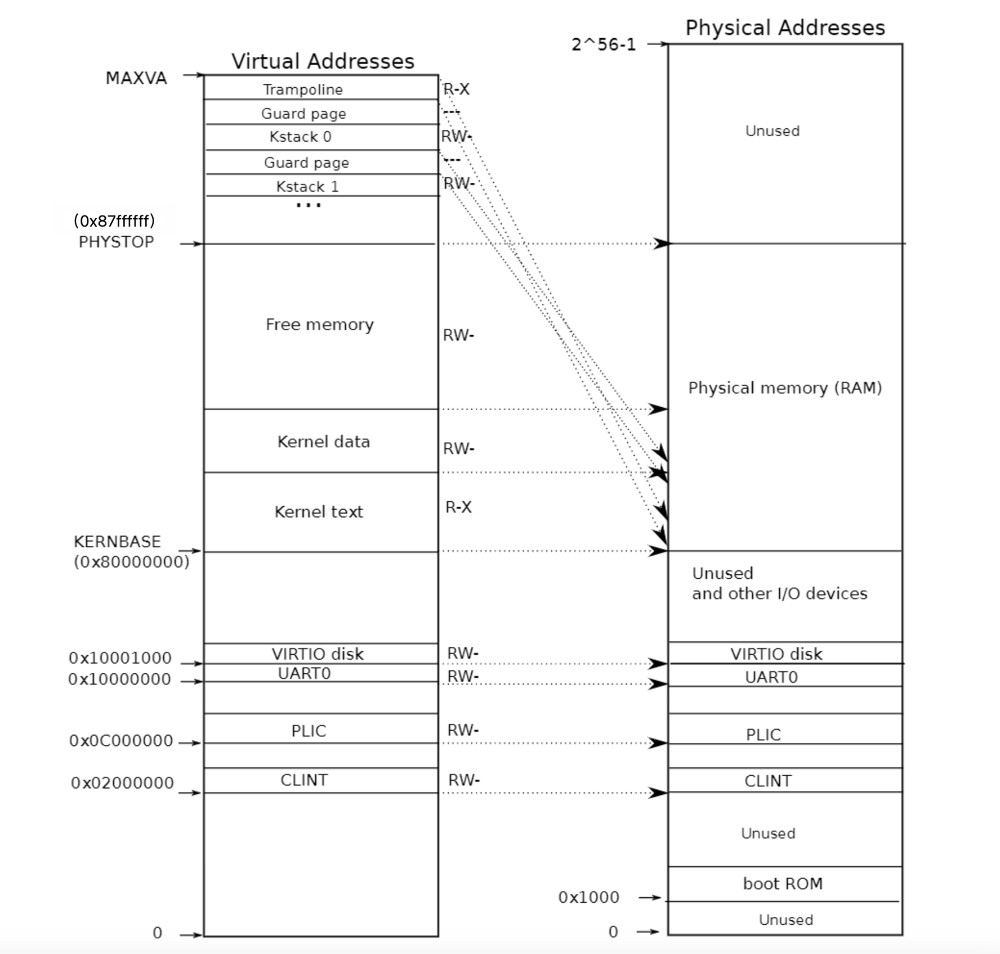
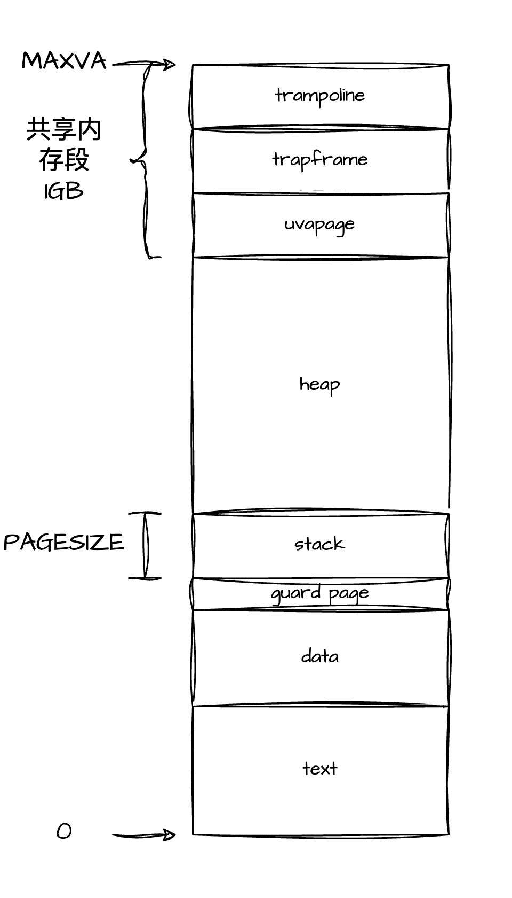

# SupremeOS 初赛文档

本项目基于 `MIT` 开源的 `Xv6` 操作系统框架，构建 `RISC-V` 架构的类 `Unix` 操作系统。截至初赛，`SupremeOS` 总共新增了 `19` 个系统调用，总计 `40` 个系统调用。

主要改进和提升体现在**内存管理模块**，**进程通信模块**，**进程管理模块**。

<!-- 总结构图 -->
<div align = center>

<p style="font-size: 12px">项目总体结构图</p>
</div>

## 目录
- [SupremeOS 初赛文档](#supremeos-初赛文档)
  - [目录](#目录)
  - [一、概述](#一概述)
    - [1.1 介绍](#11-介绍)
    - [1.2 目录和文件描述](#12-目录和文件描述)
  - [二、SupremeOS 的设计与实现-内存管理](#二supremeos-的设计与实现-内存管理)
    - [2.1 概述](#21-概述)
    - [2.2 地址空间](#22-地址空间)
    - [2.3 内存映射](#23-内存映射)
    - [2.4 伙伴系统（Buddy）](#24-伙伴系统buddy)
      - [2.4.1 概述](#241-概述)
      - [2.4.2 伙伴系统相关的数据结构](#242-伙伴系统相关的数据结构)
      - [2.4.3 伙伴系统的初始化](#243-伙伴系统的初始化)
      - [2.4.4 伙伴系统的分配](#244-伙伴系统的分配)
      - [2.4.5 伙伴系统的释放](#245-伙伴系统的释放)
    - [2.5 slab分配器](#25-slab分配器)
      - [2.5.1 概述](#251-概述)
      - [2.5.2 slab相关数据结构](#252-slab相关数据结构)
      - [2.5.3 slab池的构造函数](#253-slab池的构造函数)
      - [2.5.4 slab池的初始化](#254-slab池的初始化)
      - [2.5.5 slab池的析构](#255-slab池的析构)
      - [2.5.6 slab对象的分配](#256-slab对象的分配)
      - [2.5.7 slab对象的释放](#257-slab对象的释放)
      - [2.6 伙伴系统和slab的结合：kmalloc](#26-伙伴系统和slab的结合kmalloc)
    - [2.7 懒分配](#27-懒分配)
    - [2.8 写时复制 copy on write](#28-写时复制-copy-on-write)
  - [三、SupremeOS 的设计与实现-进程通信](#三supremeos-的设计与实现-进程通信)
    - [3.1 概述](#31-概述)
    - [3.2 IPC相关宏](#32-ipc相关宏)
    - [3.3 共享内存](#33-共享内存)
      - [3.3.1 概述](#331-概述)
      - [3.3.2 共享内存相关的数据结构](#332-共享内存相关的数据结构)
      - [3.3.3 共享内存的申请和创建](#333-共享内存的申请和创建)
      - [3.3.4 共享内存的映射](#334-共享内存的映射)
      - [3.3.5 共享内存的剥离](#335-共享内存的剥离)
      - [3.3.6 对共享内存的相关操作。](#336-对共享内存的相关操作)
    - [3.4 信号量](#34-信号量)
      - [3.4.1 概述](#341-概述)
      - [3.4.2 信号量集相关数据结构](#342-信号量集相关数据结构)
      - [3.4.3 信号量集的申请和创建](#343-信号量集的申请和创建)
      - [3.4.4 信号量集的申请与释放](#344-信号量集的申请与释放)
      - [3.4.5 信号量集的相关操作](#345-信号量集的相关操作)
    - [3.5 消息队列](#35-消息队列)
      - [3.5.1 概述](#351-概述)
      - [3.5.2 消息队列相关的数据结构](#352-消息队列相关的数据结构)
      - [3.5.3 消息队列的申请与创建](#353-消息队列的申请与创建)
      - [3.5.4 消息的发送](#354-消息的发送)
      - [3.5.5 消息的接收](#355-消息的接收)
      - [3.5.6 消息队列的相关操作](#356-消息队列的相关操作)
  - [四、SupremeOS 的设计与实现-进程管理](#四supremeos-的设计与实现-进程管理)
    - [4.1 概述](#41-概述)
    - [4.2 优先级队列调度](#42-优先级队列调度)
    - [4.3 vfork](#43-vfork)
      - [4.3.1 概述](#431-概述)
      - [4.3.2 vfork子进程的创建](#432-vfork子进程的创建)
      - [4.3.3 vfork子进程的退出和释放](#433-vfork子进程的退出和释放)
    - [4.4 辅助性的系统调用](#44-辅助性的系统调用)
      - [4.4.1 ticks](#441-ticks)
      - [4.4.2 cycles](#442-cycles)
      - [4.4.3 系统调用的跟踪](#443-系统调用的跟踪)
  - [五、总结与展望](#五总结与展望)
    - [5.1 工作总结](#51-工作总结)
    - [5.2 未来计划](#52-未来计划)


## 一、概述
### 1.1 介绍

`SupremeOS` 基于 `RISC-V` 架构，运行于 `RV64` 指令集之上，并采用 `SV39` 虚拟内存管理机制，实际物理内存限制为 `128MB`。这种配置允许操作系统有效利用虚拟地址空间进行内存管理，同时满足特定的硬件资源约束与应用需求。

### 1.2 目录和文件描述

| 文件名 | 描述 |
| :---: | :---: |
| [mkfs](./mkfs/) | 构建和运行Xv6内核 |
| [README](./README) | 项目简介和说明 |
| [doc](./doc) | 项目的比赛报告 |
| [kernel](./kernel/) | 内核源代码目录 |
| [user](./user/) | 用户源代码目录 |
| [dockerfile](./dockerfile) | docker编译相关文件 |
| [docker-compose.yml](./docker-compose.yml) | docker编译相关文件 |
| [start_docker.sh](./start_docker.sh) | 快速启动docker环境 |
| [LICENSE](./LICENSE) | 项目的许可证文件 |
| [Makefile](./Makefile) | 项目的Makefile文件 |

## 二、SupremeOS 的设计与实现-内存管理

### 2.1 概述

在 `SupremeOS` 操作系统中，内核态与用户态进程各自拥有独立的地址空间，这种内存隔离有效保护了内核数据结构，防止用户态程序的意外访问与篡改，从而降低了安全风险和系统不稳定性。

该机制依赖于 `内存管理单元（MMU）`，负责虚拟地址到物理地址的转换及不同地址空间的隔离。当用户态进程尝试访问受保护的内核资源时，`MMU` 会拦截此行为并生成 `页面错误（Page Fault）`，触发内核异常处理程序进行相应处理。

为了增强安全性，`SupremeOS` 使用 `copyout` 和 `copyin` 接口在内核态与用户态之间进行数据传输。这些接口要求显式指定数据源和目标内存区域，确保数据传输的完整性和一致性，并使错误处理更加明确和可追踪。

通过这种设计，`SupremeOS` 利用 `MMU` 的内存保护机制，确保仅授权的访问得以执行，从而进一步提升了系统的可靠性和安全性。

### 2.2 地址空间

在硬件层面的约定中，我们为 `QEMU` 虚拟机配置了 `128MB` 的物理内存。根据 `RISC-V` 架构规范，从 `0x00000000` 到 `0x7FFFFFFF` 被用于其他设备，而从 `0x80000000(KERNBASE)` 起的地址空间则预留用于引导程序和内核。因此，物理内存管理重点关注地址范围 `KERNBASE` 至 `0x87FFFFFF(PHYSTOP)` 之间的空间。

在采用 `SV39` 虚拟内存管理机制的背景下，理论上虚拟地址可扩展至 `39` 位。然而，考虑到 `RISC-V` 设计中对有符号扩展的支持，最高位用于符号表示可能会增加虚拟地址处理的复杂性。因此，我们将有效虚拟地址限制为 `38` 位，主要针对 `0x0` 至 `0x3FFFFFFFFF(MAX_VA)` 的范围进行内存管理。

结合这一约定，`SupremeOS` 对内核空间和用户空间作了以下划分：

<div align = center>

<p style="font-size: 12px">图2.1 内核空间布局</p>
</div>

其中，在 KERNBASE 至 PHYSTOP 之间的空间的布局如下图所示。该布局由 kernel.ld 文件定义。

<div align = center>

<p style="font-size: 12px">图2.2 我们管理的内存布局</p>
</div>

用户空间的布局如下图所示，其中包括各个段的分配与映射。

<div align = center>

<p style="font-size: 12px">图2.3 用户空间布局</p>
</div>

### 2.3 内存映射

`SupremeOS` 采用 `RV64` 指令集与 `SV39` 地址管理机制。

每个虚拟地址为 `64` 位，其中高 `25` 位无效，后 `39` 位被分为 `9`、`9`、`9`、`12` 四个部分，分别对应 `三级页表`、`二级页表`、`一级页表` 和 `页内偏移量`。单个物理页大小为 `4096(PGSIZE)` 字节。

`SV39` 地址管理机制采用三级页表结构，页表项的大小为 `8` 字节，其中高 `10` 位无效，第 `53` 位到第 `10` 位承载下一级页表或数据页的物理页号，末尾 `10` 位用于标志位，记录 `有效位`、`读`、`写`、`执行` 及 `用户态访问权限`。

<div align = center>

<p style="font-size: 12px">图2.4 虚拟地址映射</p>
</div>

内核空间的映射中，从 `KERNBASE` 至 `PHYSTOP` 之间的空间被直接映射，`KERNBASE` 下面有几块地址用于设备管理，也是直接映射至虚拟内存。除此以外，该区域的顶部被映射至代码段中的 `trampoline` 段(前文的布局中有提到，是用于用户态和内核态之间切换时的上下文保存的代码段)，用于快速切换至内核态。紧接着，该区域下方分配了 `64` 页的物理内存、`128` 页的虚拟内存用于内核栈，并通过使用 `guard page` 在每两页栈之间进行保护，以及时捕获潜在的栈溢出事件。

用户空间的映射采用随机的物理页映射方式。在进程创建（如 `fork` 或 `exec` ）时，操作系统会调用 `kalloc` 以获取物理页，并调用 `uvmmap` 函数进行 `代码段`、`数据段`、`栈段`、`trapframe` 页及 `trampoline` 页的映射。此时，堆段的映射将在懒分配部分中进一步说明，共享内存段的映射将在后续的进程间通信讨论中展开。

### 2.4 伙伴系统（Buddy）

#### 2.4.1 概述

伙伴系统和 `slab` 分配器是内核中用于分配物理内存的机制。其中，伙伴系统用于以页为单位分配物理页，`slab` 分配器以更小的单位(例如8B，16B等等)进行分配小块的物理内存。

我们的伙伴系统仿照 `linux` 的思路，支持从0阶到`MAX_ORDER = 11`阶大小的内存块的分配，其中`k`阶大小的内存块的大小为 $2^k$ 页，即 $2^{k + 12}$B 大小的连续内存。

我们将空闲页(从 `end`, 上文提到的内核代码和数据段结束后的首地址，到 `PHYSTOP` 之间的物理内存)以 `PGSIZE` 为单位，按照物理地址从低到高从0开始依次编号。

```c
// 伙伴系统对外开放的接口如下: 
void            kinit(void); // 初始化伙伴系统
void*           kbuddy_alloc(uint32 order); // 获取一块order阶大小的内存块
void            kbuddy_free(void* ptr, uint32 order); // 释放一块order阶大小的内存块
void*           kalloc(void); // 即为 kbuddy_alloc(0) 获取一页内存
void            kfree(void* ptr); // 即为 kbuddy_free(ptr, 0)释放一页内存
```
#### 2.4.2 伙伴系统相关的数据结构

```c
struct {
    char bitmap_page[2 * PGSIZE];
    struct run freelist_page[MAX_ORDER + 1]; // 可以理解成一个地址数组，freelist_page[i]中存放的是i阶内存块的链表首地址
    char* start;
    struct spinlock lock;
    struct ref_stru freelist; // 内存计数
} buddy;
```

`bitmap_page` 是伙伴系统的位图，里面存储了各个以i号页为起始页的各阶内存块的空闲情况，布局如下:

<div align = center>

<p style="font-size: 12px">图2.5 buddy的位视图</p>
</div>

其中某一位为0表示以 `i` 页号为起始页的k阶内存块为空闲的，为1则表示被占用着。我们用 `buddy_bitmap_offset[]` 数组来记录各阶内存块的位视图在 `bitmap_page` s中的偏移量，其中 `buddy_bitmap_offset[k]` 中记录了各个k阶空闲块的位视图的偏移量。

这种多阶的位视图对比一阶的位视图，仅仅多用了一页的位视图，就能让判断以任意页号为起始页的任意阶内存块和它的伙伴块是否为空闲的复杂度，从原本 $O(2^k)$ 变为了 $O(1)$ 的时间。这样的开销是值得的。

`freelist_page` 是一个地址数组，`freelist_page[i]` 中存放的是 `i` 阶内存块的链表首地址。其中 `run` 的结构如下：

```c
struct run {
    struct run* prev;
    struct run* next;
};
```

这是一个双向链表的结点，用于原地地存储某个空闲块的上一块内存和下一块内存的地址。这个链表的布局如下：

我们将空闲块的链表信息直接存储在空闲块的内部，这种隐式链表的优化减少了额外的内存开销和额外的指针存储，降低了内存访问次数，系统可以更快地找到和管理内存块，提高了内存分配的效率。同时，内存块地址即链表结点地址的设计也让我们能够以 $O(1)$ s的时间内对链表中部的结点进行"随机访问"，兼具了线性结构和链式结构的优点。这种隐式链表在 `slab` 中也会有所用到。

`start` 为0号内存的首地址，用于页号和物理地址的转换。

`lock` 是一个内核自旋锁，用于保护 `buddy` 内部成员的并发访问。

`freelist` 用来记录父进程的引用计数，在 `Copy on write` 章节会进行介绍。

```c
struct ref_stru {
  struct spinlock lock;
  int cnt[PHYSTOP / PGSIZE];  // 引用计数
} ref;
```

#### 2.4.3 伙伴系统的初始化

在 `SupremeOS` 的初始化中，0号 `cpu` 会调用 `buddy_init()` 来进行伙伴系统的初始化。

```c
void buddy_init(){
    initlock(&buddy.lock, "buddy"); // 初始化自旋锁

    pa_start = (char*)PGROUNDUP((uint64)end); // 将kernel.ld提供的end地址按照PGSIZE对齐
    buddy.start = pa_start; // 设置buddy管理的内存段的起始地址为start
    pnum_max = (PHYSTOP - (uint64)buddy.start) / PGSIZE; // 最大页号
    printf("pnum_max: %lu\n", pnum_max);

    buddy_init_bitmap(); // 将位视图置为全1，即全部被占用。
    buddy_init_freelist(); // 根据pnum_max，将从pa_start到PYHSTOP之间的各块物理页按照最大适配的算法加入到buddy.freelist_page中，并且将位视图的对应位置0，即置为空闲
}
```

#### 2.4.4 伙伴系统的分配

函数 `void* buddy_alloc(uint32 order)` 的任务是分配一块 $2^{order}$ 页大小的连续物理内存。其算法流程如下：

从 `buddy.freelist_page[order]` 开始查找第一个空闲块，采用链表形式的存储结构，在 $O(1)$ 时间复杂度内直接找到所需阶数的空闲块。
核心逻辑为当找到的空闲块超过目标阶数时，系统将其分步拆分为所需大小，同时将上半部分返回至对应阶数的空闲链表。
以下是分配的具体实现：

```c
void* buddy_alloc(uint32 order)
{
    if (order > MAX_ORDER)
        panic("buddy_alloc: order out of bound.");
    int free_order = order;
    // 找到第一个空闲块
    while(free_order <= MAX_ORDER && (buddy_getfirst(free_order) == 0))
    {
        ++free_order;
    }

    if (free_order > MAX_ORDER)
        return NULL;
        // panic("buddy_alloc: bad alloc.");
    
    // 将free_order给逐步拆分成order阶的内存块
    void* mem_block = buddy_erasefirst(free_order);
    if (free_order > order)
    {
        while(free_order > order)
        {
            --free_order;
            void* upper_block = (void*)((uint64)mem_block + (1 << free_order) * PGSIZE);
            buddy_insertfirst(upper_block, free_order); // 把地址相对较高的给存入链表中
        }
    }
    return mem_block;
}
```

#### 2.4.5 伙伴系统的释放

函数 `void buddy_free(void* block_start, uint32 order)` 的任务是释放一块 $2^{order}$ 页大小的物理内存。其算法流程如下：

首先，函数检查传入的内存块起始地址 `block_start` 是否符合对齐要求。
接着，计算该内存块的伙伴块地址，并检查它是否空闲。
如果伙伴块为空闲状态，则从相应的空闲链表中将其移除，并向高阶合并；否则，将当前块加入到空闲链表中。
这个过程将一直继续，直到无法合并为止，或者达到了最大阶数。

由于我们的位视图可以在 $o(1)$ 的时间内检查一个任意阶的内存块的伙伴是否为空闲的，所以这整个过程的复杂度也为 $o(1)$。

以下是释放的具体实现：

```c
void buddy_free(void* block_start, uint32 order)
{
    // 将物理地址转换为页号
    uint64 pnum = pa_to_pnum(block_start);
    
    // 检查页号是否符合对齐要求
    if (pnum & ((1 << order) - 1))
    {
        // 数据不符合要求，输出错误并终止程序
        printf("%lu\n", pnum);
        panic("buddy_free: unaligned block.");
    }

    // 初始化自由阶为要释放的阶
    uint32 freeorder = order;
    
    // 尝试合并直到达到最大阶数
    while(freeorder < MAX_ORDER)
    {
        // 计算伙伴的页号（按位异或）
        uint64 buddy_pnum = pnum ^ (1 << freeorder);
        
        // 检查伙伴块是否在有效范围内且为空闲
        if (buddy_pnum < pnum_max && !buddy_getbitmap(buddy_pnum, freeorder))
        {
            // 伙伴块空闲，进行合并
            // 从 corresponding 链表中移除伙伴块
            struct run* buddy_ptr = pnum_to_pa(buddy_pnum); 
            buddy_erase(buddy_ptr, freeorder); // 移除伙伴

            // 更新当前块的页号（按位清除对应位）
            pnum &= ~(1 << freeorder);
            // 提高自由阶级
            ++freeorder;
        }
        else
        {
            // 伙伴块不空闲，将当前块放入 freeorder 的链表中
            buddy_insertfirst(pnum_to_pa(pnum), freeorder);
            break; // 不再合并，直接退出
        }
    }

    // 如果合并到达最大阶数，则将当前块加入到相应链表
    if (freeorder == MAX_ORDER)
    {
        buddy_insertfirst(pnum_to_pa(pnum), freeorder);
    }

    return; // 释放过程结束
}
```

### 2.5 slab分配器

#### 2.5.1 概述
`slab` 分配器是内核中用于高效分配小块物理内存的机制。与伙伴系统以页为单位分配物理内存不同，`slab` 分配器以更小的内存块（例如 8B、16B 等）进行分配，这样可以减少内存碎片并提高内存利用率。

`slab` 分配器使用一个名为 `kmem_cache` 的结构体来管理不同大小的内存块池，支持小对象（小于等于 16B）和大对象（大于 16B）的分配。它通过将空闲块组织为链表的方式，提高了内存分配和释放的效率。

`slab` 的总体思路是首先调用伙伴系统来获取一些物理页，将这些物理页给拆分成多个相同大小的对象块，每次分配都以对象块为单位进行内存的分配，减少了内存碎片的同时，将内存分配的复杂度从链式管理的 $o(n)$ 减小到了 $o(1)$。

在实现的过程中，我们对小对象和大对象的 `slab` 池的结构作了不同的优化，更大限度地利用了空闲内存。

`slab` 系统不仅提供了不同大小的全局内存块池，对于一些经常分配的特定大小的对象，`slab` 还开放了接口用于创建管理特定大小的 `slab` 池，进一步地减少了内存碎片。

`slab` 池对外开放的接口列表为

```c
void            kmem_cache_create(struct kmem_cache* cache, char* name, uint16 sz, uint16 align, uint16 init_pgnum); // 构造一个名字为name, 期望分配内存块大小为sz, 地址按照align对齐, 初始拥有init_pgnum页大小的slab池
void            slab_init(); // 初始化对象大小分别为8B, 16B, 32B, 64B, 128B, 256B, 512B, 1024B的内核全局slab池
void            kmem_cache_destroy(struct kmem_cache*, int flag); // 析构这个slab池
void*           kmem_cache_alloc(struct kmem_cache*); // 从该内存池中分配一个对象
void            kmem_cache_free(struct kmem_cache*, void*); // 释放一个该内存池的对象
```

#### 2.5.2 slab相关数据结构

`slab`结构体的定义如下:

```c
struct kmem_cache{ 
    char* name;             // debug用的名字
    uint16 size;            // 期望分配的内存块的大小
    uint16 align;           // 期望分配的内存块的对齐标准
    uint16 unitsz;          // slab内存池内部实际存储的对象的大小
    uint64 alloc_count;     // 已分配的对象个数，它会在每次分配中自增，每次释放中自减
    struct spinlock lock;   // 保护临界资源的自旋锁
    union pagelink head;    // 内存池所管理的页的链表首指针
};
```

`unitsz` 是根据 `size` 和 `align` 计算出来的，比如 size = 15， align = 4，即如果想要每次分配15B的内存块，并且地址按照四字节对齐，那么我们的 `slab` 内部会实际上给每个对象分配16B的大小。

`head` 是该内存池所管理的页的链表首指针。`union pagelink` 的定义为

```c
union pagelink{
    struct snode* shead;
    struct lnode* lhead;
};

struct snode{
    struct snode* next;
};

struct lnode{
    char* curpage;
    struct lnode* next;
};
```

其中的``snode` 和 `lnode` 分别是小对象和大对象的页链表的结点，`snode` 采用隐式链接，`lnode` 采用显式链接。它们的链接结构如下：

<div align = center>

<p style="font-size: 12px">图2.6 小对象池的链接结构</p>
</div>

<div align = center>

<p style="font-size: 12px">图2.7 大对象池的链接结构</p>
</div>

对于小对象池，我们采用隐式链接，将下一页的地址存储在这一页的第一个对象所在的位置，避免了显式链接的结点的内存开销;对于大对象池，如果使用每一页的第一个对象来存储下一页的地址，会导致远大于`8B`的内存空间中只利用了`8B`，过于浪费，因此我们采用了显式链接，用外部的链接结点来指向下一页的地址。

无论对于大对象池还是小对象池，对于内部对象的链接，我们都使用隐式链接，在空闲块的位置中存储下一个可用对象的位置，采用的结构体为：

```c
struct freeblock{
    struct freeblock* next;
};
```

其内部结构为：

<div align = center>

<p style="font-size: 12px">图2.8 slab内部的对象链接</p>
</div>

隐式链接大幅减少了 `slab` 内部空闲对象链接所需要的内存空间。

#### 2.5.3 slab池的构造函数

`kmem_cache_create` 会根据 `sz` 和 `align` 的大小，调用 `init_large_object_pool` 或者 `init_small_object_pool` ，构建上述的针对不同大小对象 `slab` 池的结构。

```c
void kmem_cache_create(struct kmem_cache* cache, char* name, uint16 sz, uint16 align, uint16 init_pgnum)
{
    if(align == 0 || align & (align - 1))
        panic("kmem_cache_create: invalid alignment."); // 检查align是否为2的幂次

    initlock(&(cache->lock), name); // 初始化cache内部的自旋锁

    cache->size = sz; 
    cache->align = align;
    cache->unitsz = ALIGN_UP(sz, align); // 将sz关于align向上对齐
    if (sz > 16)
    {
        cache->head.lhead = init_large_object_pool(cache->unitsz, init_pgnum); // 将这个slab初始化为一个大对象池
    }
    else
    {
        cache->head.shead = init_small_object_pool(cache->unitsz, init_pgnum); // 将这个slab初始化为一个小对象池
    }

    printf("%s initialized.\n", name);
}
```

其中的 `init_large_object_pool` 和 `init_small_object_pool` 就是按照上述的结构，分配相应大小的页数，用相应的 `pagelink` 将它们链接起来，将页面的内部分割成相同大小的对象，用隐式链接将其和下一个空闲对象块链接起来。(这里不知道要不要贴上代码，因为代码不短)

#### 2.5.4 slab池的初始化

`main` 函数中，会调用 `slab_init`，初始化一系列管理不同大小对象的全局 `slab` 池

```c
void slab_init()
{
    kmem_cache_create(&g_slab_8, "g_slab_8", 8, 8, 2);
    kmem_cache_create(&g_slab_16, "g_slab_16", 16, 16, 2);
    kmem_cache_create(&g_slab_32, "g_slab_32", 32, 32, 2);
    kmem_cache_create(&g_slab_64, "g_slab_64", 64, 64, 2);
    kmem_cache_create(&g_slab_128, "g_slab_128", 128, 128, 2);
    kmem_cache_create(&g_slab_256, "g_slab_256", 256, 256, 1);
    kmem_cache_create(&g_slab_512, "g_slab_512", 512, 512, 1);
    kmem_cache_create(&g_slab_1024, "g_slab_1024", 1024, 1024, 1);
    kmem_cache_create(&g_slab_kmem_cache, "g_slab_kmem_cache", sizeof(struct kmem_cache), 8, 1);
}
```

#### 2.5.5 slab池的析构

`kmem_cache_destroy` 会析构一整个缓存池，`flag` 指示了此次析构是否是强制性的。如果 `flag = 0`(非强制性析构)，且这个缓存池的 `alloc_count` 非零(还有对象未被释放)，则会报错。在析构的过程中，所需要做的事情就是根据这个 `slab` 池所管理的物理页链表将其析构，并释放显式链接中的结点。

```c
void kmem_cache_destroy(struct kmem_cache* cache, int flag)
{
    acquire(&cache->lock);
    if (!flag && cache->alloc_count) // 非强制析构且slab池中有对象未被释放
    {
        release(&cache->lock);
        panic("kmem_cache_destroy.");
    }
    if (cache->size > 16)
    {
        destroy_large_object_pool(cache); // 根据显式链接的链表释放所管理的物理页
    }
    else
    {
        destroy_small_object_pool(cache); // 根据隐式链接的链表释放所管理的物理页
    }
    release(&cache->lock);
}
```

#### 2.5.6 slab对象的分配

`kmem_cache_alloc` 会从对应的 `slab` 池中取出首个空闲块。由于我们的 `slab` 池的对象之间的链接使用的是链式结构，因此这一分配过程的复杂度为 $o(1)$。如果 `slab` 池中没有对应的空闲对象，则会向伙伴系统新申请一页缓存，然后重新进行分配。

```c
void *kmem_cache_alloc(struct kmem_cache * cache)
{
    acquire(&cache->lock);
    if(cache->size > 16)
    {
        return alloc_large_object_pool(cache); // 对大对象池的对象分配
    }
    else
    {
        return alloc_small_object_pool(cache); // 对小对象池的对象分配
    }
}
```

#### 2.5.7 slab对象的释放

kmem_cache_free比kmem_cache_alloc会首先检查这个对象是否是该slab池所管理的对象，如果是，则会将待释放对象给链接成为新的首个可用对象。最近被释放的对象也会成为下一次分配中最先被分配的，在一定程度上也提高了cache的命中率。(本来想过给slab染色的，后来想了想进程的调度没有做到cpu亲和，直接给slab染色可能效果也不好。这一段要写进去吗)

```c
void kmem_cache_free(struct kmem_cache* cache, void* pa)
{
    acquire(&cache->lock);
    if(cache->size > 16)
    {
        free_large_object_pool(cache, pa);
    }
    else
    {
        free_small_object_pool(cache, pa);
    }
    release(&cache->lock);
}
```

#### 2.6 伙伴系统和slab的结合：kmalloc

有了伙伴系统和 `slab` ，现在我们的操作系统内核可以分配几乎任意大小的连续内存了。因此我们使用 `kmalloc` 和 `kmfree` 来对全局的内存分配和释放进行封装，提供一个方便的接口。`kmalloc` 会根据请求的内存块的大小，自动地选择最合适的分配器进行分配。

```c
void* kmalloc(uint64 sz)
{
    if (sz > 2048) // 超过slab池所能分配的最大大小，采用伙伴系统按页分配
    {
        uint pgnum = ((sz + PGSIZE - 1) / PGSIZE);
        int order = 0;
        while((1U << order) < pgnum)
        { // 计算获得最接近的阶数
            ++order;
        }
        return kbuddy_alloc(order); // 用伙伴系统进行分配
    }
    else
    { // 根据请求的内存块的大小，从最合适的slab池中分配内存
        if (sz > 1024)
            return kmem_cache_alloc(&g_slab_2048);
        else if (sz > 512)
            return kmem_cache_alloc(&g_slab_1024);
        else if(sz > 256)
            return kmem_cache_alloc(&g_slab_512);
        else if(sz > 128)
            return kmem_cache_alloc(&g_slab_256);
        else if(sz > 64)
            return kmem_cache_alloc(&g_slab_128);
        else if(sz > 32)
            return kmem_cache_alloc(&g_slab_64);
        else if(sz > 16)
            return kmem_cache_alloc(&g_slab_32);
        else if(sz > 8)
            return kmem_cache_alloc(&g_slab_16);
        else
            return kmem_cache_alloc(&g_slab_8);
    }
}
```

kmfree的思路与kmalloc一致。

### 2.7 懒分配

`SupremeOS` 的内存管理模块采用懒分配的策略，即只有当进程需要使用内存时，才会进行内存分配。这种策略可以有效地减少内存的浪费，提高内存的利用率。

用户在调用 `sbrk` 进行内存分配时，`SupremeOS` 先不分配真实的物理内存，而是将其虚拟地址记录，并标记为无效，在进程第一次尝试使用分配的页面时，`CPU` 将产生一个页面错误，在错误处理中再进行真实物理内存分配，以实现延迟分配的效果，减少开销。

```c
// 修改 sys_sbrk
uint64
sys_sbrk(void)
{
    uint64 addr;
    int n;

    argint(0, &n);
    addr = myproc()->sz;

    // 错误处理
    if(n>0){
      myproc()->sz += n;
    }else if (myproc()->sz > (uint64)(-n)) {
      uvmdealloc(myproc()->pagetable, myproc()->sz, myproc()->sz + n);
    }else {
      return -1;
    }
  
    // Lazy allocation 先不进行内存分配
    // if(growproc(n) < 0)
    //   return -1;

   return addr;
}

// usertrap()中的页面错误
if(r_scause() == 13 || r_scause() == 15){ // 加载页面与保存页面错误
    uint64 va;
    va = r_stval();
    pte_t* pte = walk(p->pagetable, va, 0);

    if ((*pte & PTE_V) == 0){
      if (uvlazyalloc(p->pagetable, va) < 0) {
        setkilled(p);
      } 
    }
}
```

### 2.8 写时复制 copy on write

传统的 `fork()` 系统调用将父进程的所有用户空间内存复制到子进程中。如果父进程较大，则复制可能需要很长时间。更糟糕的是，这项工作经常造成大量浪费；例如，子进程中的 `fork()` 后跟 `exec()` 将导致子进程丢弃复制的内存，而其中的大部分可能都从未使用过。

`COW fork()` 只为子进程创建一个页表，用户内存的PTE指向父进程的物理页。`COW fork()` 将父进程和子进程中的所有用户 `PTE` 标记为不可写。当任一进程试图写入其中一个 `COW` 页时，`CPU` 将强制产生页面错误。内核页面错误处理程序检测到这种情况将为出错进程分配一页物理内存，将原始页复制到新页中，并修改出错进程中的相关 `PTE` 指向新的页面，将 `PTE` 标记为可写。当页面错误处理程序返回时，用户进程将能够写入其页面副本。

```c
// uvmcopy 函数添加 COW 页面标记

// 仅对可写页面设置COW标记
if(flags & PTE_W) {
    // 禁用写并设置COW Fork标记
    flags = (flags | PTE_F) & ~PTE_W;
    *pte = PA2PTE(pa) | flags;
}

// cow页面分配函数
void* cowalloc(pagetable_t pagetable, uint64 va) {
	// 未对齐
  	if(va % PGSIZE != 0){
    	return 0;
	}

  	uint64 pa = walkaddr(pagetable, va);  // 获取对应的物理地址
  	if(pa == 0){
    	return 0;
	}

  	pte_t* pte = walk(pagetable, va, 0);  // 获取对应的PTE

  	if(krefcnt((char*)pa) == 1) {
   		// 只剩一个进程对此物理地址存在引用
    	// 则直接修改对应的PTE即可
    	*pte |= PTE_W;
    	*pte &= ~PTE_F;
    	return (void*)pa;
  	} else {
    	// 多个进程对物理内存存在引用
    	// 需要分配新的页面，并拷贝旧页面的内容
    	char* mem = kalloc();
    	if(mem == 0)
    	  return 0;

    	// 复制旧页面内容到新页
    	memmove(mem, (char*)pa, PGSIZE);

    	// 清除PTE_V，否则在mappagges中会判定为remap
    	*pte &= ~PTE_V;

    	// 为新页面添加映射
    	if(mappages(pagetable, va, PGSIZE, (uint64)mem, (PTE_FLAGS(*pte) | PTE_W) & ~PTE_F) != 0) {
    	  	kfree(mem);
    	  	*pte |= PTE_V;
    	  	return 0;
    	}

    	// 将原来的物理内存引用计数减1
    	kfree((char*)PGROUNDDOWN(pa));
    	return mem;
  	}
}
```


## 三、SupremeOS 的设计与实现-进程通信

### 3.1 概述

在现代操作系统中，`进程间通信（Inter-Process Communication, IPC）`是确保进程协同工作的关键机制。`SupremeOS` 在设计过程中借鉴了 `System V IPC` 接口的成熟模型，旨在实现一个高效且易用的进程通信模块，支持共享内存、信号量和消息队列三种主要通信机制。我们通过对 `System V` 的接口进行分析与改进，设计出严格 `RAII` 的，适合本操作系统架构的 `IPC` 解决方案，以实现更高的安全性和灵活性。

### 3.2 IPC相关宏
`IPC.h` 中定义了一些 `IPC` 通用的宏，用于分析指令和处理权限。权限控制中，我们将32位的 `flag` 的后12位划分给权限位，其中第8-11位为该IPC所有者的权限位，第4-7位为该 `IPC` 同组成员的权限位，第0-3位为其他用户的权限位。

```c
// 命令
#define IPC_SET         0
#define IPC_RMID        1
#define IPC_STAT        2

// 属性
#define IPC_EXCL        1U << 14 // 已经有该键值的IPC时，会报错
#define IPC_CREATE      1U << 15 // 在有需要的前提下进行IPC的创建
#define IPC_NOWAIT      1U << 16 // 非阻塞式命令

// 权限控制
#define IPC_OWNER_MASK  15U << 8 // flag的第8位到第11位为该IPC所有者的权限位
#define IPC_GROUP_MASK  15U << 4 // flag的第4位到第7位为该IPC同组成员的权限位
#define IPC_OTHER_MASK  15U      // flag的第0位到第3位为其他用户的权限位
#define IPC_R           1 << 1 // 读权限
#define IPC_W           1 << 2 // 写权限
#define IPC_X           1 << 3 // 执行权限
#define IPC_C           1 << 4 // 修改权限的权限

// 可见性控制
#define IPC_PRIVATE     0 // 表示匿名的ipc，用于进程内的标识

enum ipcstate // IPC的状态。
{
    IPC_UNUSED, // 空闲的IPC
    IPC_ZOMBIE, // 有程序正在引用但是被置为可以被析构的控制块，一旦引用计数归零就会被析构
    IPC_USED    // 不会因为引用计数归零而被析构的IPC
};
```

为了实现键值到 `IPCID` 的映射，我们在 `ipc_hash.h` 中定义了一套通用的 `Hash` 宏作为泛型，用于支持不同 `IPC` 池的操作。解决 `IPC` 桶中的哈希冲突，我们采用了线性探测法。这种设计确保了在不提高代码复杂度的前提下在碰撞发生时能够有效地定位到可用的存储位置，从而提高了哈希表的整体性能和存取效率。

```c
// 从uint64到poolsize大小的IPC桶的哈希。
#define HASH_FUNC(poolsize) \
static ipc_id hash(key_t key) \
{ \
    return key % (poolsize); \
}

// 如果找到了key,那么返回key所在的id,如果没找到key,返回第一个空闲的id,如果满了,返回-1
// 0为保留key，不能有shm的键值为0
#define AT_FUNC(name, poolsize) \
ipc_id name##_at(key_t key) \
{ \
    ipc_id id = hash(key); \
    ipc_id origin_id = id; \
    ipc_id first_free = -1; \
    int find_free = 0; \
    for (;;) \
    { \
        acquire(&name##id_pool[id].lk); \
        if (name##id_pool[id].key == key) \
        { \
            release(&name##id_pool[id].lk); \
            break; \
        } \
        if (!find_free && name##id_pool[id].state == IPC_UNUSED) \
        { \
            find_free = 1; \
            first_free = id; \
        } \
        release(&name##id_pool[id].lk); \
        id = (id + 1) % (poolsize); \
        if (id == origin_id) \
            break; \
    } \
    acquire(&name##id_pool[id].lk); \
    if (name##id_pool[id].key != key) \
    { \
        release(&name##id_pool[id].lk); \
        return first_free; \
    } \
    else \
    { \
        release(&name##id_pool[id].lk); \
        return id; \
    } \
}
```

### 3.3 共享内存
#### 3.3.1 概述
`共享内存(shm)` 是一种高效的 `进程间通信（IPC）机制`，允许多个进程访问同一块物理内存区域。这种机制尤其适用于需要快速数据交换和低通信延迟的应用场景，例如多媒体处理、实时数据分析和高性能计算等。相比其他 `IPC` 方式，共享内存的性能优势在于用户态进程可以直接通过内存解引用操作访问共享数据，而无需频繁切换到内核态，大幅减少了系统开销。然而，这种高效性也伴随着潜在的安全性和一致性风险，需要在设计中加以权衡和管理。

在我们的操作系统设计中，共享内存的管理策略如下：

内存分配与记录：操作系统在内核中分配特定大小的空闲物理内存区域，并使用 `shmblock` 数据结构记录每段共享内存的元信息。

虚拟地址布局：在内存管理中有提到，共享内存段位于用户态地址空间的 `trapoline` 和 `trapframe` 之下的 `1GB` 虚拟地址空间中。这一布局设计确保了共享内存段的位置固定且易于管理。

<div align = center>

<p style="font-size: 12px">图3.1 共享内存段</p>
</div>


虚拟地址映射：每当用户进程申请一段共享内存，操作系统会从共享内存段中划分出一块可用的虚拟地址范围，并通过 `MMU` 建立该虚拟地址与物理内存的映射关系。一旦映射完成，用户进程可以直接访问共享内存，无需进一步的内核态交互，从而降低 `IPC` 开销。

此外，我们采用`资源获取即初始化（RAII）`的思想来管理共享内存的生命周期。每个进程会记录其映射的共享内存段。当某块共享内存被标记为 `IPC_ZOMBIE` 状态且引用计数降为零时，系统才会回收并释放对应的物理内存。这种设计确保了资源的自动管理和安全释放，避免了资源泄漏的风险。

```c
// 共享内存相关的系统调用：
int     shmget(key_t key, uint64 size, int shmflg); // 根据key来获取或者创建一块共享内存，大小为size，shmflg指示了该共享内存的权限。例如shmflg = IPC_CREATE | IPC_EXCL | 0x666，指示了此次shmget将创建一个对所有者，同组成员，其他成员均可读可写的共享内存，且如果已经有了相同键值的共享内存，将会返回错误。
void*   shmat(ipc_id shmid, const void* shmaddr, int shmflg); //

// 将shmid对应的共享内存块给映射至用户空间的虚拟地址shmaddr。当shmaddr为NULL(0)时，代表由操作系统自己来分配可用的虚拟地址。shmflg将与shm本身的权限进行按位与，生成该进程对于该共享内存的权限。
void    shmdt(void* shmaddr); // 将shmaddr所映射的那块共享内存从本进程中剥离，解除映射。
int     shmctl(int shmid, int cmd, struct shmid_ds *buf); // 对shmid所对应的共享内存进行操作，操作码由cmd指定。可用的cmd有IPC_STAT(获取该IPC的状态)， IPC_SET(修改IPC的权限，需要有修改权限的权限)，IPC_RMID(将该共享内存标志为IPC_ZOMBIE，即可删除状态，一旦它的引用计数归零，则共享内存将会被释放)。
```

#### 3.3.2 共享内存相关的数据结构

共享内存控制块的结构：

```c
struct shmblock {
    struct spinlock lk;             // 保护临界资源的自旋锁
    ipc_id          id;             // IPC 资源 ID
    uint            sz;             // 共享内存段大小，单位为字节
    int             ref_count;      // 当前附加的进程数
    uint            flag;           // 权限
    key_t           key;            // 键值
    void*           ptr;            // 共享内存实际的物理地址
    enum ipcstate   state;          // 该共享内存的状态
};

struct shmblock shmid_pool[SHMMAX];
```

每一个 `shmblock` 都唯一对应着一个共享内存。在内核中，用 `shmid_pool` 来管理全部的共享内存，每次申请共享内存，都会从 `shmid_pool` 中进行申请。

用户用以修改和获取 `shmid` 信息的结构体：

```c
struct shmid_ds {
    uint            sz;             // 共享内存段大小
    int             ref_count;      // 当前附加的进程数
    uint            flag;           // 权限
    enum ipcstate   state;          // 该共享内存的状态
};
```

在 `shmctl` 中，如果操作码是 `IPC_STAT` ，则 `shmblock` 的相应信息将被复制到 `shmid_ds` 中，如果是 `IPC_SET` ，则会忽视 `shmid_ds` 中除了 `flag` 之外的其他字段。这样的设计让用户态与内核态的共享内存相隔离，不能直接地访问内核的 `shm` 控制块，进一步加强了安全性。

前文提到，共享内存的映射将被映射至用户地址空间的共享内存段，进程将使用 `freeva` 链表来维护可用的虚拟地址块，并采用最先适应的算法来进行虚拟地址分配。同时，每次共享内存的映射完成后，进程会使用 `proc_shmblock` 来维护该进程所有的共享内存引用，在进程被释放或者调用shmdt进行共享内存块的剥离时，这些引用也会被释放，用于管理共享内存的生命周期。

<div align = center>

<p style="font-size: 12px">图3.2 可用虚拟地址的管理</p>
</div>

<div align = center>

<p style="font-size: 12px">图3.3 进程引用共享内存的管理</p>
</div>

```c
struct freeva
{
    uint64 ptr;
    struct freeva* next;
    uint64 npg;
};

struct proc_shmblock
{
    uint flag;
    void* va;
    struct shmblock* shm;
    struct proc_shmblock* next;
};
```

#### 3.3.3 共享内存的申请和创建

`shmget` 会根据参数中的配置来申请或创建一块共享内存。`flag` 的末12位为权限位，前20位中，`IPC_CREATE` 位指定了是否允许共享内存的创建，`IPC_EXCL` 指定了是否在已有相同键值的共享内存后报错。

```c
ipc_id shmget(key_t key, uint64 size, uint flag)
{
    ipc_id id = shm_at(key);
    if (flag & IPC_CREATE)
    {
        acquire(&shmid_pool[id].lk);
        if ((flag & IPC_EXCL) && (shmid_pool[id].state != IPC_UNUSED))
        {
            release(&shmid_pool[id].lk);
            return -2; // 指定IPC_EXCL后，会在已有相同键值的共享内存块时直接返回错误值
        }
        if (shmid_pool[id].state == IPC_UNUSED)
        { // 创建一块新的共享内存，此时它的引用计数仍然为0
            ... // 共享内存的初始化
            return id;
        }
        else
        { // 返回已有的共享内存块号
            release(&shmid_pool[id].lk);
            return id;
        }
    }
    else
    {
        acquire(&shmid_pool[id].lk);
        if (shmid_pool[id].state == IPC_UNUSED)
        { // 没有指定IPC_CREATE，且不存在该键值的共享内存，返回错误值
            release(&shmid_pool[id].lk);
            return -1;
        }
        else
        { // 返回已有的共享内存块号
            release(&shmid_pool[id].lk);
            return id;
        }
    }
}
```

#### 3.3.4 共享内存的映射

`shmat` 的作用为将对应 `shmid` 的共享内存给映射至用户空间，这样进程就可以通过普通的指针操作来访问共享内存数据。调用 `shmat` 成功后，它将返回一个指向共享内存段的指针（用户态虚拟地址）。操作系统会通过 `freeva` 的链表，查询首个可用的虚拟地址，通过三级页表来进行地址映射。

由于 `SV39` 用页式管理内存，因此每次分配虚拟地址都是以页为单位的。由于共享内存段的空间大小远大于实际的物理内存，且虚拟地址并不占用实际上的物理资源，因此对虚拟地址的些许浪费换来复杂度的提升和管理的便捷性，是可以接受的。

同时因为算法设计从用户空间的最顶部开始试图分配地址，因此可以更大程度地和 `trampoline` 与 `trapframe` 共享一级页表，这也一定程度上提升了物理内存的利用率和 `TLB` 的命中率。

```c
void* shmat(int shmid, const void* shmaddr, int shmflag)
{
    struct proc* p = myproc();
    ... // 检查shmid是否有效
    uint64 npg = (shmid_pool[shmid].sz + PGSIZE - 1) / PGSIZE; // 计算所需要的虚拟地址页数
    // 权限处理
    int flag;
    if (1)
    {
        flag = (shmid_pool[shmid].flag & IPC_OWNER_MASK) >> 8;
    }
    if (shmflag & SHM_RDONLY)
    {
        flag &= (~IPC_W) & (~IPC_X);
    }
    release(&shmid_pool[shmid].lk);
    // 内存映射
    void* freeva = NULL;
    if (shmaddr == NULL)
    {
        freeva = uallocva(p->freeva_head, npg); // 分配用户态虚拟地址
        mappages(p->pagetable, (uint64)(freeva), npg * PGSIZE, (uint64)(shmid_pool[shmid].ptr), PTE_U | flag); // 内存映射
        ... // 在PCB中记录下对共享内存的引用
        shmid_pool[shmid].ref_count += 1; // 增加引用计数
    }
    return freeva;
}
```

#### 3.3.5 共享内存的剥离

`shmdt` 会将该用户态虚拟地址所映射的共享内存从用户地址空间中剥离，"归还"虚拟地址（因为共享内存段的虚拟地址实际上并不独立拥有物理内存，所以这里的归还是逻辑上的），并且减少该共享内存的引用计数。如果共享内存的状态为 `IPC_ZOMBIE(可析构状态)` 且引用计数为 0，则该共享内存将会被物理意义上地释放。

```c
void shmdt(struct proc* p, const void* shmaddr)
{
    struct proc_shmblock* prev = findprev_procshmblock(&p->proc_shmhead, NULL, shmaddr); // 找到PCB中，该虚拟地址所对应的共享内存引用
    struct shmblock* shm = prev->next->shm;
    uvmunmap(p->pagetable, (uint64)(shmaddr), (shm->sz + PGSIZE - 1) / PGSIZE, 0); // 解除映射，将共享内存块从用户空间中剥离

    acquire(&shm->lk);
    shm->ref_count -= 1;
    if (shm->state == IPC_ZOMBIE && shm->ref_count == 0)
    {
        // printf("shm destructed.\n");
        shm_reinit(shm); // 满足条件时，释放共享内存
    }
    release(&shm->lk);

    struct proc_shmblock* newnext = prev->next->next;
    kmfree(prev->next, sizeof(struct proc_shmblock)); // 释放相关管理资源
    prev->next = newnext;
}
```

#### 3.3.6 对共享内存的相关操作。

`shmctl` 会对 `shmid` 所对应的共享内存进行操作，操作码由 `cmd` 指定：

IPC_STAT(获取该IPC的状态)
IPC_SET(修改IPC的权限，需要有修改权限的权限)
IPC_RMID(将该共享内存标识为IPC_ZOMBIE，即可删除状态，一旦它的引用计数归零，则共享内存将会被释放)。

```c
int shmctl(int shmid, int cmd, struct shmid_ds *buf)
{
    ... // 检查shmid的有效性
    switch(cmd)
    {
        case IPC_SET: { // 设置共享内存的权限
            shmid_pool[shmid].flag = buf->flag;
            break;
        }
        case IPC_RMID: { // 将共享内存置为可删除
            shmid_pool[shmid].state = IPC_ZOMBIE;
            if (shmid_pool[shmid].ref_count == 0)
            {
                printf("shm destructed.\n");
                shm_reinit(shmid_pool + shmid);
            }
            break;
        }
        case IPC_STAT: { // 获取共享内存的信息
            buf->sz = shmid_pool[shmid].sz;
            buf->ref_count = shmid_pool[shmid].ref_count;
            buf->flag = shmid_pool[shmid].flag;
            buf->state = shmid_pool[shmid].state;
        }
        default: {
            release(&shmid_pool[shmid].lk);
            return -2; // 未知的命令
        }
    }
    release(&shmid_pool[shmid].lk);
    return 0;
}
```

### 3.4 信号量

#### 3.4.1 概述

`信号量集（semaphore set）` 是一种经典的 `进程间同步与通信（IPC）机制`，用于在多个进程间协调对共享资源的访问。`SupremeOS` 的信号量集借鉴了 `system v` 的设计哲学和接口，设计优先考虑高自由度，高性能和轻量化，避免了复杂度为 $o(n^2)$ 起步的，复杂的死锁检测与优先级反转逻辑。我们的想法是开放更丰富的接口，给予用户更多的自由度，将选择权和责任交由用户态，由用户在设计并发逻辑时遵循最佳实践，避免潜在的死锁或优先级反转问题。在未来版本中，我们可能会计划探索轻量级的死锁检测算法作为可选功能模块，以增强系统的健壮性。

我们的信号量集在内核中分配内存，并由专门的数据结构记录每个信号量的元信息，包括当前计数值、最大值、等待队列等，对用户态仅开放接口，提高了信号量集机制的安全性。同时允许阻塞式和非阻塞式的请求，也提高了灵活性，为用户态的超时逻辑提供了基础。

```c
// 信号量集相关的系统调用:
int         semget(key_t key, uint64 size, uint flag); // 获取或创建一个键值为key，包含size个信号量的信号量集。flag指示了该共享内存的权限，指示规则与共享内存一致。
int         semop(int semid, struct sembuf* sops, uint nsops); // 向semid所管理的信号量集中一次性请求或释放nsops个资源
int         semctl(int semid, int semnum, int cmd, union semun un); // 对信号量集进行操作，操作码由cmd决定，semnum指定了该操作所针对的信号量在信号量集中的索引
```

#### 3.4.2 信号量集相关数据结构

信号量控制块的结构：

```c
struct semblock {
    struct spinlock lk;             // 保护临界资源的自旋锁
    ipc_id          id;             // IPC 资源 ID
    uint            sz;             // 信号量数量
    int             ref_count;      // 当前附加的进程数
    uint            flag;           // 权限
    key_t           key;            // 键值
    struct sem*     ptr;            // 信号量集
    enum ipcstate   state;          // 该信号量集的状态
};

struct semblock semid_pool[SEMMAX];
```

与共享内存相同地，每一个 `semblock` 都唯一对应着一个信号量集。在内核中，用 `semid_pool` 来管理全部的信号量集，每次创建信号量集，都会从 `semid_pool` 中进行申请。

在信号量集中，单个信号量的结构为:

```c
struct sem
{
    int         value;              // 资源数量
    struct wait_queue queue;        // 等待队列
};
```

每个信号量都有自己的等待队列，这方便了信号量集内的乱序申请和乱序请求。

信号量的申请与释放使用 `sembuf` 数组，这允许用户一次性进行多个资源的释放和请求，对一次操作中的操作策略也可以针对不同的信号量进行个性化设置。自由度和易用度，这是 `SupremeOS` 的一大宗旨。

```c
struct sembuf
{
    uint        sem_index;  // 信号量在信号量集中的索引
    int16       sem_op;     // sem_op > 0代表资源释放， sem_op < 0代表资源申请
    uint16      sem_flg;    // sem_flg可以指定为0(阻塞式操作)或IPC_NOWAIT(非阻塞式操作)
};
```

用户用以修改和获取信号量集信息的结构体：

```c
union semun // semctl的参数
{
    int16           val;
    struct semid_ds*  buf;
    int16*          array;
};

struct semid_ds
{
    uint            sz;             // 信号量集中信号量的个数
    int             ref_count;      // 当前附加的进程数
    uint            flag;           // 权限
    enum ipcstate   state;          // 该信号量集的状态
};
```

当 `semctl` 的 `cmd` 为 `IPC_STAT` 或者 `IPC_SET` 时，`semun` 会被解释为 `semid_ds*`，当 `cmd` 为 `GETALL` 或 `SETALL` 时，它会被解释为 `int16*`，当它为 `GETALL` 或 `SETALL` 时，它会被解释为 `int16`。具体的实现会在后文中提到。

与共享内存类似地，信号量集也采用了 `RAII` 的思想来管理信号量集的生命周期，这使用了 `proc_semblock` 结构体。

```c
struct proc_semblock
{
    uint flag;
    struct semblock* sem;
    struct proc_semblock* next;
};
```

#### 3.4.3 信号量集的申请和创建

`semget` 的使用方法与 `shmget` 的使用方法几乎一致。这种接口的一致性也是我们更倾向于 `system v` 规范的原因之一。

`semget` 会根据参数中的配置来申请或创建一个信号量集。`flag` 的末12位为权限位，前20位中，`IPC_CREATE` 位指定了是否允许信号量集的创建，`IPC_EXCL` 指定了是否在已有相同键值的信号量集后报错。

```c
ipc_id semget(key_t key, uint64 size, uint flag)
{
    ipc_id id = sem_at(key);
    struct proc* p = myproc();
    if (flag & IPC_CREATE)
    {
        acquire(&semid_pool[id].lk);
        if ((flag & IPC_EXCL) && (semid_pool[id].state != IPC_UNUSED))
        {
            release(&semid_pool[id].lk);
            return -2; // 指定IPC_EXCL后，会在已有相同键值的信号量集时直接返回错误值
        }
        if (semid_pool[id].state == IPC_UNUSED)
        { // 创建一个size大小的sem数组
            ... // 将信号量集中的信号量全部初始化
            return id;
        }
        else
        { 
            ... // 返回已有的sem块号
            return id;
        }
    }
    else
    {
        acquire(&semid_pool[id].lk);
        if (semid_pool[id].state == IPC_UNUSED)
        { // 没有指定IPC_CREATE，且不存在该键值的信号量集，返回错误值
            release(&semid_pool[id].lk);
            return -1;
        }
        else
        { 
            ... // 返回已有的sem块号
            return id;
        }
    }
}
```

#### 3.4.4 信号量集的申请与释放

`semop` 会根据参数中传入的 `sembuf` 数组，一次性地对 `semid` 信号量集中的信号量进行申请或释放。用户可以对 `sembuf` 的 `flag` 字段作修改，来实现一次操作中对不同信号量采取不同的申请策略。

对于阻塞式操作，如果此次资源申请未能成功，会将进程阻塞睡眠，直至其他进程的释放操作唤醒了等待队列中的进程; 对于非阻塞式操作，如果此次资源未能成功则会直接返回错误值。

由于各个信号量都拥有自己的等待队列，因此可以做到"精准阻塞"和"精准唤醒"，避免了过多的轮询和对同一个信号量的多次阻塞。

```c
int semop(int semid, struct sembuf* sops, uint nsops)
{
    ... // 检查semid的有效性
    struct proc* p = myproc();
    ... // 由于内核和用户不共享地址空间，因此将sops给复制进内核空间
    acquire(&semid_pool[semid].lk);
    for (int i = 0;i < nsops; ++i)
    {
        if (semid_pool[semid].sz <= buf[i].sem_index)
        {
            release(&semid_pool[semid].lk);
            return -3; // 未知信号量索引
        }

        struct sem* sem = semid_pool[semid].ptr + buf[i].sem_index;
        if (buf[i].sem_op < 0)
        { // wait操作，即资源的申请
            if (sem->value < (-buf[i].sem_op))
            { // 资源不够用
                if(buf[i].sem_flg & IPC_NOWAIT)
                {
                    return -4; // 非阻塞式，直接返回
                }
                insert_last(&sem->queue, p); // 将进程阻塞至该信号量的等待队列中
                p->sem_want = (-buf[i].sem_op);
                sleep((char*)p + 1, &semid_pool[semid].lk);
                // 被唤醒后从这里继续运行
            }
            else
            { // 资源够用
                sem->value += buf[i].sem_op;
            }
        }
        else if(buf[i].sem_op > 0)
        { // signal操作，即资源的释放
            ... // 逐个唤醒等待队列中的进程，直至等待队列为空或者资源不足以满足下一个进程的申请
        }
        // sem_op == 0就是啥也不干找茬来的
    }
    release(&semid_pool[semid].lk);
    return 0;
}
```

#### 3.4.5 信号量集的相关操作

`semctl` 会对 `semid` 所对应的信号量集进行操作，操作码由 `cmd` 指定。

```c
IPC_STAT(获取该IPC的状态)
IPC_SET(修改IPC的权限，需要有修改权限的权限)
IPC_RMID(将该信号量集标识为IPC_ZOMBIE，即可删除状态，一旦它的引用计数归零，则共享内存将会被释放)
SETALL(对信号量集内的所有信号量进行统一的赋值)
GETALL(获取当前信号量集内所有信号量的资源量)
SETVAL(对某个位置的信号量进行赋值)。
GETVAL(获取某个位置的信号量的资源量)。
```

`semnum` 只在 `cmd` 为 `GETVAL` 或 `SETVAL` 时生效，`arg` 会根据 [3.4.2](#342-信号量集相关数据结构) 中所规定的，根据不同的 `cmd`，被解释为不同类型的参数。

```c
int semctl(int semid, int semnum, int cmd, uint64 arg)
{
    ... // 检查semid的有效性
    union semun un;
    struct proc* p = myproc();
    switch(cmd)
    {
        case IPC_RMID:
        {
            semid_pool[semid].state = IPC_ZOMBIE; // 标识为IPC_ZOMBIE
            proc_remsem(p, semid_pool + semid);   // 减少引用计数
            break;
        }
        case IPC_STAT:
        {
            ... // 获取信号量集的状态
            break;
        }
        case GETALL:
        {
            ... // 将信号量集中的值拷贝至arg中的数组中
            break;
        }
        case GETVAL:
        {
            int16 v = semid_pool[semid].ptr[semnum].value; // 返回semnum位置的信号量的值
            return v;
        }
        case SETALL:
        {
            ... // 根据arg中的数组，批量地设置信号量的值
            break;
        }
        case SETVAL:
        {
            un.val = (int16)(arg);
            semid_pool[semid].ptr[semnum].value = un.val; // 根据arg中的值设置semnum位置的信号量
            break;
        }
        default:
        {
            return -1; // 未知的cmd
        }
    }
    release(&semid_pool[semid].lk);
    return 0;
}
```

### 3.5 消息队列

#### 3.5.1 概述
```消息队列（Message Queue）``` 被广泛用于在多个进程之间传递小块的数据或控制信息，既避免了共享内存的越界访问的安全性问题，又抽象了手动使用信号量集进行管理的繁琐操作。

秉承着一贯的高灵活度和自由度的原则，我们的消息队列同样地为消息的发送和接收提供了阻塞式和非阻塞式两种收发策略。同时，我们为消息队列设置了消息上限，防止因为消息的收发速率差距等原因而堆积大量未处理的消息而消耗过多内存。

消息队列相关的系统调用：

```c
int         msgget(key_t key, uint32 maxlen, uint32 flag); // 获取或创建一个键值为key，消息上限为maxlen的消息队列，maxlen指定为0时，则为系统的默认最大长度(16)。flag指示了该共享内存的权限，指示规则与共享内存一致。
int         msgsnd(ipc_id msqid, const struct msgbuf* msgp, int msgflg); // 向指定消息队列中发送消息，msgflg可以指定为0(阻塞式发送)或IPC_NOWAIT(非阻塞式发送)
int         msgrcv(ipc_id msqid, struct msgbuf* msgp, uint32 msgsz, uint32 msgtype, int msgflg); // 从指定消息队列中接收消息，msgsz指定此次允许接收的最大长度，msgtype指定了想要接收的信息类型，为0则可以接收任何信息。msgflg为此次接收的策略。
int         msgctl(ipc_id msqid, int cmd, struct msqid_ds* buf); // 对消息队列进行操作，操作码由cmd决定
```

#### 3.5.2 消息队列相关的数据结构

消息队列控制块的结构：

```c
struct msg_queue
{
    struct spinlock lk;             // 保护临界资源的自旋锁
    ipc_id          id;             // IPC 资源 ID
    struct msg_msg* first;          // 消息队列的首指针
    struct msg_msg* last;           // 消息队列的尾指针
    uint            flag;           // 权限位
    key_t           key;            // 键值
    int             msg_count;      // 消息队列的总长
    uint32          maxlen;         // 消息队列的限长
    int             ref_count;      // 当前附加的进程数
    enum ipcstate   state;          // 该消息队列的状态
};

struct msg_queue msqid_pool[MSGMAX];
```

与共享内存和信号量集相同地，每一个 `msg_queue` 都唯一对应着一个消息队列。在内核中，用 `msgid_pool` 来管理全部的消息队列，每次创建消息队列，都会从 `msgid_pool` 中进行申请。

每个消息队列中的消息结点的结构为：

```c
struct msg_msg // 512B
{
    struct msgbuf   content;    // 消息内容
    struct msg_msg* next;       // 下一个消息结点
};

struct msgbuf // 504B
{
    int32   mtype;              // 消息类型
    uint32  length;             // 消息长度
    char    mtext[MSGSIZE_MAX - sizeof(int32) - sizeof(uint32) - sizeof(void*)]; // 消息正文，最长496B
};
```

单个消息结点的大小被设置为恰好 `512B`，这样能更大限度地利用一页的内存，减小内存碎片。每个消息正文的长度不能超过 `496B`，这也与消息队列主要用于传递小块数据和控制信息的作用相符合。如果需要传递大块的数据，则更适合使用共享内存。

用户用以修改和获取信号量集信息的结构体：

```c
struct msqid_ds
{
    int             msg_count;  // 消息队列的总长
    uint32          maxlen;     // 消息队列的限长
    int             ref_count;  // 当前附加的进程数
    enum ipcstate   state;      // 该消息队列的状态
    uint            flag;       // 权限
};
```

信号量集同样也采用了 `RAII` 的思想来管理生命周期，这使用了 `proc_semblock` 结构体。

```c
struct proc_msgblock
{
    uint                flag;
    struct msg_queue*   msq;
    struct proc_msgblock* next;
};
```

#### 3.5.3 消息队列的申请与创建

`msgget` 的使用方法与 `shmget`，`semget` 的使用方法几乎一致。

`msgget` 会根据参数中的配置来申请或创建一个消息队列。`flag` 的末 `12` 位为权限位，前 `20` 位中，`IPC_CREATE` 位指定了是否允许消息队列的创建，`IPC_EXCL` 指定了是否在已有相同键值的消息队列后报错。创建中会使用 `maxlen` 指定消息队列的上限长度，`maxlen` 为 `0` 时则为默认的限长 `16`。

```c
ipc_id msgget(key_t key, uint32 maxlen, uint flag)
{
    ipc_id id = msq_at(key);
    struct proc* p = myproc();
    if (flag & IPC_CREATE)
    {
        acquire(&msqid_pool[id].lk);
        if ((flag & IPC_EXCL) && (msqid_pool[id].state != IPC_UNUSED))
        {
            release(&msqid_pool[id].lk);
            return -2; // 指定IPC_EXCL后，会在已有相同键值的消息队列时直接返回错误值
        }
        if (msqid_pool[id].state == IPC_UNUSED)
        { 
            ... // 创建一个新的空消息队列，并设置权限和限长
            return id;
        }
        else
        { 
            ... // 返回已有的msq块号
            return id;
        }
    }
    else
    {
        acquire(&msqid_pool[id].lk);
        if (msqid_pool[id].state == IPC_UNUSED)
        { // 没有指定IPC_CREATE，且不存在该键值的消息队列，返回错误值
            release(&msqid_pool[id].lk);
            return -1;
        }
        else
        { 
            ... // 返回已有的msq块号
            return id;
        }
    }
}
```

#### 3.5.4 消息的发送

`msgsnd` 会根据 `msgflg` 来选择不同的发送策略。当消息队列已经到达消息上限的时候，如果 `msgflg` 为 `IPC_NOWAIT(非阻塞式发送)`，`msgsnd` 会直接返回错误值，如果为 `0`(阻塞式发送)，则会将进程阻塞睡眠，直到有其他进程取出了消息腾出位置后，将其重新唤醒并且继续发送信息。

```c
int msgsnd(ipc_id msqid, const struct msgbuf *msgp, int msgflg)
{
    ... // 检查msqid的有效性
    ... // 根据用户的传入的消息内容新建一个消息结点
    if(newmsg->content.mtype <= 0)
    {
        return -3; // 消息的类型mtype需要为正整数。无效的mtype
    }

    acquire(&msqid_pool[msqid].lk);
    if ((msqid_pool[msqid].msg_count) >= msqid_pool[msqid].maxlen)
    { // 消息队列长度过长
        if (msgflg & IPC_NOWAIT)
        { // 非阻塞，直接返回-1
            release(&msqid_pool[msqid].lk);
            kmfree(newmsg, sizeof(struct msg_msg));
            return -1;
        }
        else
        { // 阻塞，进程阻塞
            do
            {
                sleep(SND_CHAN(msqid_pool[msqid]), &msqid_pool[msqid].lk);
            }while((msqid_pool[msqid].msg_count) >= msqid_pool[msqid].maxlen);
        }
    }
    ... // 将新的消息结点加入到消息队列中
    release(&msqid_pool[msqid].lk);
    wakeup(RCV_CHAN(msqid_pool[msqid])); // 唤醒正在等待消息的接收进程
    return 0;
}
```

#### 3.5.5 消息的接收

`msgrcv` 会根据 `msgtype` 来选择性地接收第一个满足条件的消息。如果 `msgtype` 为 `0`，则会接收队列中的第一个消息。同样地，`msgrcv` 也提供了阻塞式和非阻塞式两种策略。

```c
int msgrcv(ipc_id msqid, struct msgbuf* msgp, uint32 msgsz, uint32 msgtype, int msgflg)
{
    ... // 检查msqid的有效性
    struct msg_msg* prev = NULL;
    if (msqid_pool[msqid].first == NULL)
    { // 队列为空
        if(msgflg & IPC_NOWAIT)
        { // 非阻塞式接收
            release(&msqid_pool[msqid].lk);
            return -1; // 无对应类型的消息
        }
        else
        { // 阻塞式接收，等到非空为止
            do
            {
                sleep(RCV_CHAN(msqid_pool[msqid]), &msqid_pool[msqid].lk);
            } while (msqid_pool[msqid].first == NULL);
        }
    }

    // 此时队列非空
    for (;;)
    { // 为了找到所需要类型的消息的前驱节点
        ... // 寻找所需要类型的消息的前驱节点
        if (!found)
        { // 没找到
            if(msgflg & IPC_NOWAIT)
            {
                release(&msqid_pool[msqid].lk);
                return -1; // 无相应type的消息
            }
            else
            { // 睡眠，醒过来后进行下一轮检查
                sleep(RCV_CHAN(msqid_pool[msqid]), &msqid_pool[msqid].lk);
            }
        }
        else
        { // 找到了，跳出循环
            break;
        }
    }
    ... // 将获得的消息复制到用户空间中
    wakeup(SND_CHAN(msqid_pool[msqid])); // 唤醒正在等待消息队列空闲的发送进程
    return 0;
}
```

#### 3.5.6 消息队列的相关操作

`msgctl` 会对相应消息队列进行操作，操作码由 `cmd` 指定。

```c
IPC_STAT(获取消息队列的状态)
IPC_SET(修改消息队列的权限和限长，需要有修改权限的权限)
IPC_RMID(将该消息队列标识为IPC_ZOMBIE，即可删除状态，一旦它的引用计数归零，则消息队列将会被释放)。
```

```c
int msgctl(ipc_id msqid, int cmd, struct msqid_ds* buf)
{
    ... // 检查msqid的有效性
    struct proc* p = myproc();
    switch (cmd)
    {
        case IPC_STAT:
        {
            ... // 将消息队列的状态复制到用户空间
            break;
        }
        case IPC_SET:
        {
            ... // 设置消息队列的权限和限长
            break;
        }
        case IPC_RMID:
        {
            msqid_pool[msqid].state = IPC_ZOMBIE; // 将状态标识为IPC_ZOMBIE
            proc_remmsq(p, msqid_pool + msqid); // 减少引用计数
            break;
        }
        default:
        {
            release(&msqid_pool[msqid].lk);
            return -3; // 未知的指令
        }
    }
    release(&msqid_pool[msqid].lk);
    return 0;
}
```

## 四、SupremeOS 的设计与实现-进程管理

### 4.1 概述
`进程管理` 是操作系统内核中最为核心的部分之一，它负责进程的创建、调度、切换、同步、通信以及销毁等操作，是操作系统实现多任务处理的基础。在 `SupremeOS` 中，我们实现了 `进程优先级调度` 以及 `vfork`，为操作系统提供了强大的进程管理能力。

### 4.2 优先级队列调度

<!-- xv6 原先的进程调度为FIFO，即按照进程创建的顺序进行调度，而 `SupremeOS` 则实现了基于优先级的多级反馈队列调度算法。该算法将进程分为多个优先级队列，每个队列中的进程按照优先级进行调度，优先级越高的进程优先被调度。同时，该算法还实现了进程的抢占式调度，即当一个高优先级的进程就绪时，会立即抢占正在运行的低优先级进程，从而保证高优先级进程的及时响应。 -->

`xv6` 原先的进程调度为 `FIFO`，即按照进程创建的顺序进行调度，而 `SupremeOS` 则实现了基础的优先级调度，每个进程都有一个优先级，优先级越高的进程优先被调度。

在 `proc` 结构体中添加 `priority`，在 `scheduler` 进行调度时添加判断即可。
```c
// Per-process state
struct proc {
    // ...
    int priority;                         // 进程优先级
    // ...
};

void
scheduler(void)
{
  struct proc *p;
  struct cpu *c = mycpu();

  c->proc = 0;
  for(;;){
    // The most recent process to run may have had interrupts
    // turned off; enable them to avoid a deadlock if all
    // processes are waiting.
    intr_on();
    struct proc *pmax = 0;
    int found = 0;

    for(p = proc; p < &proc[NPROC]; p++) {
      acquire(&p->lock);
      if(p->state == RUNNABLE) {
        if (!found || p->priority > pmax->priority){
          if (found){
            release(&pmax->lock);
          }
          pmax = p;
          found = 1;
        }else {
          release(&p->lock);
        }
      }else {
        release(&p->lock);
      }
    }

    if (found){
      // Switch to chosen process.  It is the process's job
      // to release its lock and then reacquire it
      // before jumping back to us.
      pmax->state = RUNNING;
      c->proc = pmax;
      // printf("pid: %d, priority: %d\n", p->pid, p->priority);

      // swtch中会直接ret到p->context的ra中，即会在这里隐式地跳出函数，
      // 直到下一次计时器中断后又回到这里继续进行循环。
      swtch(&c->context, &pmax->context);
      // Process is done running for now.
      // It should have changed its p->state before coming back.
      c->proc = 0;

      release(&pmax->lock);
    }else {
      // nothing to run; stop running on this core until an interrupt.
      intr_on();
      asm volatile("wfi");
    }
  }
}
```

### 4.3 vfork
#### 4.3.1 概述

尽管我们在 `fork` 中，加入了 `写时复制(cow)` 的机制，避免了数据页的大量复制，在 `fork` 时大幅地降低了创建子进程所需要消耗的资源。然而，`fork` 依旧需要创建自己的页表，并且拥有属于自己的对于 `IPC` 资源的管理结点，这些开销依旧没有被避免。因此，针对那些创建大量进程或需要创建后立即调用 `exec` 的场景中，我们引入了 `vfork` 系统调用。

`vfork` 直接复用了父进程的根页表，接管了共享内存段虚拟空间的管理权限，接管了对 `IPC` 资源的管理权限，除了用于储存陷入内核态时上下文的 `trapframe` 以外，不拥有任何额外的资源，最大幅度地减小了创建进程的开销。

<div align = center>

<p style="font-size: 12px">图4.1 fork</p>
</div>

<div align = center>

<p style="font-size: 12px">图4.2 vfork</p>
</div>


#### 4.3.2 vfork子进程的创建

与 `fork` 中的 `allocproc` 不同，`vfork` 会调用 `allocproc_v` ，它分配的子进程没有自己的根页表。

```c
static struct proc* allocproc_v(void)
{
    struct proc *p;
    ... // 分配一块可用的PCB
    return 0;

    found:
    p->pid = allocpid();
    p->state = USED;

    // vfork的进程有自己的陷阱帧
    if((p->trapframe = (struct trapframe *)kalloc()) == 0){
        freeproc(p);
        release(&p->lock);
        return 0;
    }

    // vfork的进程不需要自己的页表

    // vfork的进程有自己的cpu的context
    memset(&p->context, 0, sizeof(p->context));
    p->context.ra = (uint64)forkret;
    p->context.sp = p->kstack + PGSIZE;

    return p;
}
```

在 `vfork` 中，子进程会直接接管父进程的根页表和所有的 `IPC` 资源的管理权，随后将父进程阻塞。同时子进程会将父进程空间中的 `TRAPFRAME` 页给映射到自己的 `trapframe` 中。因此子进程对父进程的堆栈操作， `IPC` 操作均会直接体现在父进程中。因此 `vfork` 需要确保子进程的尽快返回，避免对父进程的内存空间进行过多的修改而造成未定义行为。

```c
int vfork()
{
    int i, pid;
    struct proc *np;
    struct proc *p = myproc();

    // 分配子进程
    if((np = allocproc_v()) == 0){
        return -1;
    }

    np->traceMask = p->traceMask;
    np->vforked = 1; // vfork字段置为1，在释放时就不会释放父进程的资源了。

    // 接管使用父进程的页表
    np->pagetable = p->pagetable;

    // 将TRAPFRAME位置的虚拟内存所映射的内存页替换为自己的trapframe
    uvmunmap(np->pagetable, TRAPFRAME, 1, 0);
    mappages(np->pagetable, TRAPFRAME, PGSIZE, (uint64)(np->trapframe), PTE_R | PTE_W);

    // 接管父进程的shm块, sem块, msg块
    np->proc_shmhead.next = p->proc_shmhead.next;
    np->proc_semhead.next = p->proc_semhead.next;
    np->proc_msghead.next = p->proc_msghead.next;

    // 接管父进程的shm地址管理块
    np->freeva_head->next = p->freeva_head->next;
    np->sz = p->sz;

    // 复制父进程的寄存器
    *(np->trapframe) = *(p->trapframe);

    // 在子进程中返回0
    np->trapframe->a0 = 0;
    ... // 和fork一样，设置父进程指针，复制父进程名字等等
    
    // 将父进程阻塞，直到子进程exit或exec后，会唤醒父进程
    acquire(&wait_lock);
    sleep(p, &wait_lock);
    release(&wait_lock);

    return pid;
}
```

#### 4.3.3 vfork子进程的退出和释放

在 `vfork` 出来的子进程的退出中，需要向父进程归还根页表的所有权，归还 `IPC` 资源的所有权，并将 `TRAPFRAME` 页重新映射到父进程的 `trapframe` 。同时，在释放子进程资源时，只需要释放 `trapframe` 页，而无需释放堆内存。

子进程的退出：

```c
void
exit(int status)
{
    ... 
    // 如果是vfork出来的进程
    if(p->vforked)
    {
        // 归还shm, sem, msg管理块和虚拟地址管理块的管理权
        p->parent->proc_shmhead.next = p->proc_shmhead.next;
        p->parent->proc_semhead.next = p->proc_semhead.next;
        p->parent->proc_msghead.next = p->proc_msghead.next;

        p->proc_shmhead.next = NULL;
        p->proc_semhead.next = NULL;
        p->proc_msghead.next = NULL;

        // 归还虚拟内存段的管理权
        p->parent->freeva_head->next = p->freeva_head->next;
        p->freeva_head->next = NULL;
        
        // 归还trapframe
        uvmunmap(p->pagetable, TRAPFRAME, 1, 0);
        mappages(p->pagetable, TRAPFRAME, PGSIZE, (uint64)(p->parent->trapframe), PTE_W | PTE_R);
    }
    ... // 唤醒父进程，将PCB状态置为ZOMBIE
    sched(); // 进入下一个调度
    panic("zombie exit");
}
```

子进程的释放：

```c
static void
freeproc(struct proc *p)
{
    if(p->trapframe) // 释放trapframe
        kfree((void*)p->trapframe);
    p->trapframe = 0;
    if(p->pagetable)
    {
        proc_freesem(p); // 此时vfork的proc_semhead为空，会直接返回
        proc_freemsq(p); // 此时vfork的proc_msghead为空，会直接返回
        if (!p->vforked)
        { // 非vfork出来的进程
            // 清理共享内存引用计数
            // 清理堆内存
            proc_freeshm(p);
            proc_freepagetable(p->pagetable, p->sz);
        }
    }
    ... // 初始化PCB
}
```

### 4.4 辅助性的系统调用
#### 4.4.1 ticks

`ticks` 表示 `CPU` 时钟中断发生的次数。每个 `CPU` 的时钟中断由 `CLINT（Core Local Interruptor` 模块生成。当 `CPU 0` 触发一个时钟中断时，`ticks` 的计数会自增 `1`。我们将时钟中断的频率设置为 10Hz，因此 `ticks` 的值可以被用作粗略衡量自系统启动以来至调用 `ticks` 期间所经过的时间的指标。

```c
void clockintr() // 时钟中断
{
    if(cpuid() == 0){ // 只有当cpu0发出中断时，tick自增
        acquire(&tickslock);
        ticks++;
        wakeup(&ticks);
        release(&tickslock);
    }


    w_stimecmp(r_time() + 1000000); // 将下一次时钟中断的时间定为0.1s之后
}

uint getticks() // 返回ticks
{
    uint t;
    acquire(&tickslock);
    t = ticks;
    release(&tickslock);
    return t;
}
```
#### 4.4.2 cycles

在 `RISC-V` 架构中，每个 `CPU` 核心配备有一个系统计时器，系统计时器的时间戳存储在 `控制状态寄存器 (CSR)` 的 `time` 中。该系统计时器的频率设定为 `10 MHz`，这使得 `time` 寄存器的值可以作为一个高精度的时间衡量工具，可用于实时操作和性能监测。

在每个 `CPU` 启动时，我们会将各个核心的 `time` 寄存器的初始值记录在一个预定义的数组中。这一步骤确保了在多核系统中，我们能够有效地追踪每个 `CPU` 核心的时间戳。随后，当需要获取自系统启动以来的周期数时，我们调用 `cycles()` 函数，该函数会读取当前的 `time` 寄存器值，并与先前记录的初始值进行比较。通过计算二者之间的差值，我们能够获得自系统开机以来的准确周期计数。

这一机制不仅可以用于性能评测，还能够为实时系统提供精确的时间跟踪，有助于调度、同步和资源管理等任务的实现。借助于高精度的时间戳，我们也能够为应用程序和操作系统提供所需的时间信息，从而实现更为精确和有效的操作控制。

```c
uint64 init_cycles[NCPU];

void cyclesinithart()
{
    init_cycles[cpuid()] = r_time();
}

uint64 getcycles()
{
    return r_time() - init_cycles[cpuid()];
}
```

#### 4.4.3 系统调用的跟踪

在 `SupremeOS` 中，所有的系统调用均经过 `syscall()` 函数进行处理。为了增强对进程行为的监控与调试，我们在 `进程控制块（PCB` 中添加了一个 `tracemask` 字段。这个字段的引入使我们能够检测某个用户态进程是否成功调用了特定的系统调用。这对用户态的监控与调试，以及未来可能进行的 `性能分析(benchmark)` 都有着一定意义。

```c
void syscall(void)
{
  int num;
  struct proc *p = myproc();

  num = p->trapframe->a7; // 获取系统调用号
  uint64 traceMask = p->traceMask; // 获取该进程所追踪的系统调用
  if(num > 0 && num < NELEM(syscalls) && syscalls[num]) {
    if (traceMask & TRACE_MASK(num))
    {
        printf("\nprocess with pid %d calls syscall %s.\n", p->pid, syscallNames[num]); // 打印系统调用信息
    }
    p->trapframe->a0 = syscalls[num](); // 进入系统调用
  } else {
    printf("pid: %d, name: %s: unknown sys call %d\n",
            p->pid, p->name, num); // 未知系统调用
    p->trapframe->a0 = -1;
  }
}
```

## 五、相关测试用例

### 5.1 共享内存测试用例: shmtest.c

我们在`shmtest.c`中，对共享内存的相关功能进行了测试。为了测试`IPC`的生命周期，我们在`shm`的回收中加入了提示
```c
... // shm资源的回收
printf("shm destructed.\n");
... // shm资源的回收
```

测试代码如下：
```c
int main()
{
    int shmid1 = shmget(1, 1000, IPC_CREATE | 0x0666); // 获取一个键值为1的共享内存标识符
    int shmid2 = shmget(1, 1000, 0); // 返回上面已有的共享内存标识符
    int shmid3 = shmget(1, 1000, IPC_CREATE | IPC_EXCL); // 指定了IPC_EXCL，此时会返回错误值-2
    int shmid4 = shmget(4097, 200, IPC_CREATE | IPC_EXCL); // 获取一个新的共享内存标识符
    void* ptr = shmat(shmid2, 0, 0); // 将键值为1的共享内存给映射到共享内存段
    *((uint64*)ptr) = 0; // 赋一个初值
    printf("%d, %d, %d, %d.\n", shmid1, shmid2, shmid3, shmid4); // 期望结果应为1，1，-2，2
    if(fork()) // 使用共享内存在父子进程中进行通信，fork会继承父进程对于共享内存段的引用并复制映射
    { // 父进程
        *((uint64*)ptr) = 100; // 修改共享内存
        sleep(10); // 等待子进程读取和修改共享内存段信息
        printf("parent shm value: %lu.\n", *((uint64*)ptr)); // 获取共享内存段信息，期望结果应为200
        *((uint64*)ptr) = 300; // 修改共享内存
        wait(NULL); // 等待子进程结束
    }
    else
    {
        sleep(5);
        printf("child shm value1: %lu.\n", *((uint64*)ptr)); // 获取共享内存段信息，期望结果应为100
        *((uint64*)ptr) = 200; // 修改共享内存
        sleep(10); // 等待父进程读取和修改共享内存段信息
        printf("child shm value1: %lu.\n", *((uint64*)ptr)); // 获取共享内存段信息，期望结果应为300
    }
    // 这条指令会在父子进程中执行两次，但是不会出错，对一个已经是IPC_ZOMBIE的进程再次IPC_RMID，just do nothing.
    shmctl(shmid1, IPC_RMID, NULL); // 将shm置为IPC_ZOMBIE，在进程结束后由操作系统来回收资源
    exit(0);
}   
```

测试结果如下：
```c
$ shmtest
1, 1, -2, 2.
child shm value1: 100.
parent shm value: 200.
child shm value2: 300.
shm destructed.
```

可以看到我们一共申请了2块共享内存，只释放了一块，是因为第二块共享内存尽管没有进程进行映射，引用计数为0，但是没有进程对它进行`IPC_RMID`，因此它并不会被释放，而是留在内核中等待其他进程的映射请求。

对此，我们只需要做一个修改：

```c
... // 其他操作同上
shmctl(shmid4, IPC_RMID, NULL); // 将第二块共享内存（键值为4097）也置为IPC_ZOMBIE，它也会被释放。
exit(0);
```

此时，就会显示两个`shm`均被释放:
```
$ shmtest
1, 1, -2, 2.
child shm value1: 100.
parent shm value: 200.
child shm value2: 300.
shm destructed.
shm destructed.
```

### 5.2 信号量集测试用例：semtest.c

对于信号量集机制，我们首先利用它，在用户代码中实现了一个互斥锁`mutex`，本质上是一个仅包含了1个二值信号量的信号量集的特化:

```c
mutex_id init_mutex(key_t key)
{
    mutex_id mid = semget(key, 1, IPC_CREATE | IPC_EXCL | 0x0666);
    union semun val;
    val.val = 1;
    semctl(mid, 0, SETVAL, val);
    return mid;
}

int acquire_mutex(mutex_id mutexid)
{
    struct sembuf op;
    op.sem_flg = 0;
    op.sem_index = 0;
    op.sem_op = -1;
    return semop(mutexid, &op, 1);
}

int release_mutex(mutex_id mutexid)
{
    struct sembuf op;
    op.sem_flg = 0;
    op.sem_index = 0;
    op.sem_op = 1;
    return semop(mutexid, &op, 1);
}

void destruct_mutex(mutex_id mutexid)
{
    union semun pad;
    semctl(mutexid, 0, IPC_RMID, pad);
}
```

利用这个互斥锁，我们可以将`printf`这个并不原子化的函数当作临界区进行保护，使父子进程有序地进行输出：

```c
int main()
{
    mutex_id mutex = init_mutex(42);
    if (fork())
    {
        acquire_mutex(mutex); // 用互斥锁进行临界区的保护
        printf("parent output.\n");
        release_mutex(mutex);
    }
    else
    {
        acquire_mutex(mutex); // 用互斥锁进行临界区的保护
        printf("child output.\n");
        release_mutex(mutex);
    }
    wait(NULL);
    exit(0);
}
```

结果如下：
```
$ semtest
parent output.
child output.
```

如果没有这个互斥锁，两个进程将竞争使用串口输出，会出现以下结果：
```
$ semtest
parent ocuhtipludt .o
utput.
```

除了互斥锁以外，他还可以用于进程同步，让父子进程交替进行，实现一个朴素的生产者-消费者模型:
```c
int main()
{
    mutex_id mutex = init_mutex(2);
    ipc_id semophore = semget(42, 2, IPC_CREATE | IPC_EXCL | 0x0666);
    int16 val[2] = {0, 1}; // 信号量集内有2个信号量，分别指示缓冲区的full和empty
    union semun arg; arg.array = val;
    semctl(semophore, 0, SETALL, arg);
    if (fork())
    { // 消费者进程
        for (int i = 0;i < 10; ++i)
        {
            struct sembuf op;
            op.sem_flg = 0; 
            op.sem_index = 0;
            op.sem_op = -1; 
            semop(semophore, &op, 1); // 消耗一个full
            
            acquire_mutex(mutex); // 保护临界区
            printf("consumer proc.\n");
            release_mutex(mutex);
            
            op.sem_index = 1;
            op.sem_op = 1;
            semop(semophore, &op, 1); // 产出一个empty
        }
    }
    else
    { // 生产者进程
        for (int i = 0;i < 10; ++i)
        {
            struct sembuf op;
            op.sem_flg = 0; 
            op.sem_index = 1;
            op.sem_op = -1; 
            semop(semophore, &op, 1); // 消耗一个empty
            
            acquire_mutex(mutex); // 保护临界区
            printf("productor proc.\n");
            release_mutex(mutex);
            
            op.sem_index = 0;
            op.sem_op = 1;
            semop(semophore, &op, 1); // 产出一个full
        }
    }

    wait(NULL);
    semctl(semophore, 0, IPC_RMID, arg); // 将信号量置为IPC_ZOMBIE
    destruct_mutex(mutex); // 析构互斥锁
    exit(0);
}
```

结果为：
```
$ semtest
productor proc.
consumer proc.
productor proc.
consumer proc.
productor proc.
consumer proc.
productor proc.
consumer proc.
productor proc.
consumer proc.
productor proc.
consumer proc.
productor proc.
consumer proc.
productor proc.
consumer proc.
productor proc.
consumer proc.
productor proc.
consumer proc.
sem destructed.
sem destructed.
```

### 5.3 消息队列测试用例：msgtest.c

我们为消息队列同样地进行了测试。父进程作为接收进程，可信息的类型由1-10顺序进行，而子进程作为发送进程，按照类型10-1逆序地发送信息。由于采用的是阻塞式接收，因此父进程依旧会顺序接收到类型为1-10的信息。

```c
int main()
{
    volatile int msqid = msgget(100, 0, IPC_CREATE); // 创建一个键值为100，限长为16（操作系统默认限长）的消息队列
    printf("%d.\n", msqid);
    if (fork())
    { // 父进程作为接收进程
        for (int i = 1;i <= 10; ++i)
        {
            struct msgbuf buf;
            // 仅接受消息类型为i的信息，且不接受消息中长度超过2 * i的部分，阻塞式接收
            msgrcv(msqid, &buf, 2 * i, i, 0);
            printf("mtype: %d, mtext: %s\n", buf.mtype, buf.mtext);
        }
    }
    else
    { // 子进程作为发送进程
        for (int i = 10;i >= 1; --i)
        { // 为了测试，让子进程逆序发送
            struct msgbuf buf;
            buf.mtype = i; // 消息类型为i
            buf.length = 13;
            strcpy(buf.mtext, "Hello parent.");
            msgsnd(msqid, &buf, 0); // 阻塞式发送
        }
    }
    wait(NULL);
    msgctl(msqid, IPC_RMID, NULL);
    exit(0);
}
```

测试结果如下：
```
$ msgtest
4.
mtype: 1, mtext: He
mtype: 2, mtext: Hell
mtype: 3, mtext: Hello 
mtype: 4, mtext: Hello pa
mtype: 5, mtext: Hello pare
mtype: 6, mtext: Hello parent
mtype: 7, mtext: Hello parent.
mtype: 8, mtext: Hello parent.
mtype: 9, mtext: Hello parent.
mtype: 10, mtext: Hello parent.
msq destructed.
```

消息队列同样可以作为实现生产者消费者模型的`IPC`手段：

```c
int main()
{
    int msqid = msgget(100, 0, IPC_CREATE); // 创建一个键值为100，限长为16（操作系统默认限长）的消息队列
    mutex_id mutex = init_mutex(42);
    if (fork())
    { // 父进程作为消费者进程
        struct msgbuf startmsg;
        startmsg.length = 0;
        startmsg.mtype = 1; // 类型为1的消息指示生产者可以进行生产
        msgsnd(msqid, &startmsg, 0); // 启动生产
        for (int i = 0;i < 10; ++i)
        {
            struct msgbuf buf;
            msgrcv(msqid, &buf, 0, 2, 0); // 收到类型为2的消息后开始消费
            acquire_mutex(mutex);
            printf("consumer proc.\n");
            release_mutex(mutex);
            buf.mtype = 1;
            msgsnd(msqid, &buf, 0); // 让生产者继续生产
        }
    }
    else
    { // 子进程作为生产者进程
        for (int i = 0;i < 10; ++i)
        {
            struct msgbuf buf;
            msgrcv(msqid, &buf, 0, 1, 0); // 收到类型为1的消息后开始生产
            acquire_mutex(mutex);
            printf("producer proc.\n");
            release_mutex(mutex);
            buf.mtype = 2;
            msgsnd(msqid, &buf, 0); // 让消费者继续消费
        }
    }
    msgctl(msqid, IPC_RMID, NULL);
    exit(0);
}
```
结果如下：
```
$ msgtest
producer proc.
consumer proc.
producer proc.
consumer proc.
producer proc.
consumer proc.
producer proc.
consumer proc.
producer proc.
consumer proc.
producer proc.
consumer proc.
producer proc.
consumer proc.
producer proc.
consumer proc.
producer proc.
consumer proc.
producer proc.
consumer proc.
msq destructed.
```

尽管在上面的这种过分简化的生产者-消费者模型中，消息队列可能不如信号量集的性能高，但是在更为复杂的进程同步情境下，消息队列仍旧是非常优秀的一种进程同步手段。

### 5.4 vfork测试用例：vforktest.c

vfork会继承父进程的几乎所有资源，对此，我们作了以下测试：

```c
int main()
{
    volatile int y = 0;
    int* p = (int*)(malloc(sizeof(int)));
    *p = 0;
    ipc_id sem = semget(44, 1, IPC_CREATE | 0x666);
    if(vfork())
    {
        printf("parent data : %d, %d.\n", y, *p); // 预期结果为100, 200
        struct sembuf op;
        int r = semop(sem, &op, 1);
        printf("semop result: %d\n", r); // 这里信号量已被子进程释放，因此为错误代码-2
    }
    else
    {
        // 这是非常危险的一段代码，事实上vfork应当尽可能地不去修改任何的内存空间，
        // 尽量不去对父进程的任何资源进行修改，否则极有可能引起UB
        y = 100; 
        *p = 200;
        union semun pad;
        semctl(sem, 0, IPC_RMID, pad);
    }
    exit(0);
}
```

结果为：
```
$ vforktest
sem destructed.
parent data : 100, 200.
semop result: -2
```

如果换为fork，则结果为：
```
parent data : 0, 0.
semop result: 0
sem destructed.
```

### 5.5 TODO

## 六、总结与展望

### 6.1 工作总结

在本次操作系统大赛中，我们团队通过设计与实现基于 `RISC-V` 架构的 `SupremeOS` ，积累了丰富的经验与教训。以下是本次工作的主要成果与体会：

- 系统实现:

我们成功以 `xv6-riscv` 为基础，完善并构建了一个基于 `RV64` 指令集之上的操作系统，采用了 `SV39` 虚拟内存管理机制，搭建了完整的内存管理体系，包含 `内存隔离`、`地址空间划分`、`伙伴系统` 和 `slab` 分配器等模块。

实现了内核态与用户态之间的安全隔离，增加了系统的稳定性与安全性。在内存管理中，通过利用内存管理单元 (MMU) 和高效的数据传输接口 (copyin/copyout)，确保数据传输的完整性和一致性。

我们实现了`共享内存`、`信号量集`和`消息队列`三种主要的 `IPC` 机制，借鉴了 `System V IPC` 接口，增强了系统的灵活性和鲁棒性。这一机制使得不同进程间可以安全、高效地共享数据，从而提升了应用的 `performance` 。

- 性能检测与调试工具：

引入了时间测量的系统调用，并在 `进程控制块 ` 中添加了 `tracemask` 字段，以监测特定系统调用的调用情况。这一功能对于后期调试与性能分析提供了极大的便利，很好地满足了开发需求。

- 性能优化与资源管理：

采用懒分配、写时复制等高效内存管理技术，减少了内存的无效分配和资源的浪费。同时，优化了系统调用的处理流程，提高了系统的响应速度。

### 6.2 未来计划

- [ ] 实现基于优先级的多级反馈队列调度算法，允许抢占式调度，提高系统的响应速度和吞吐量

- [ ] 引入 `CPU` 亲和性的进程调度，并对内存管理模块的 `buddy` 和 `slab` 进行优化，为每个 `CPU` 引进缓存，提高 `cache` 的命中率

- [ ] 引入线程概念，实现用户级线程和内核级线程

- [ ] 为信号量集引入内核级别的死锁的检测与预防机制

- [ ] 实现内存的页缓存

- [ ] 实现信号机制

- [ ] 实现文件映射和匿名映射

- [ ] 实现虚拟文件系统

- [ ] 实现基于`FAT32`的文件系统

- [ ] 提供除串口I/O设备以外的更多的设备支持

- [ ] 完善网络模块，提供本地socket接口和与硬件接口交互的网络驱动程序

- [ ] 完善用户态应用程序的生态，引入代码编辑器，编译器等工具链